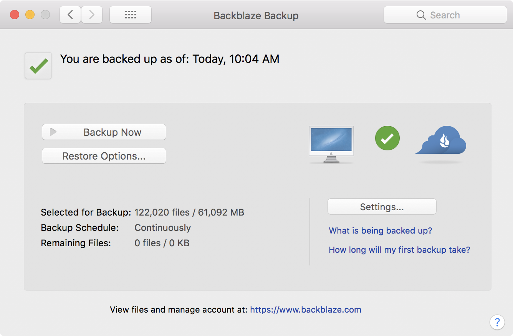
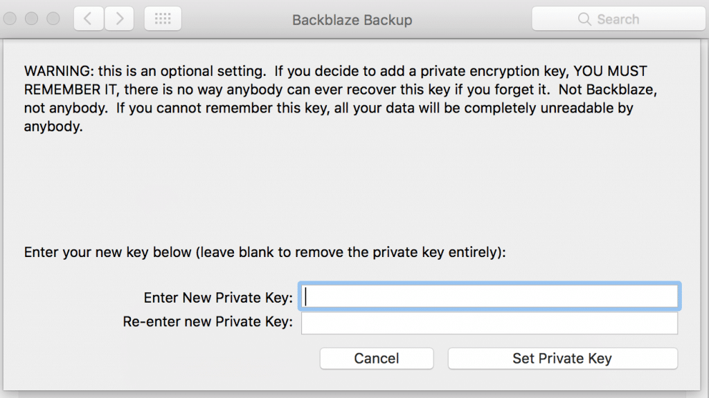
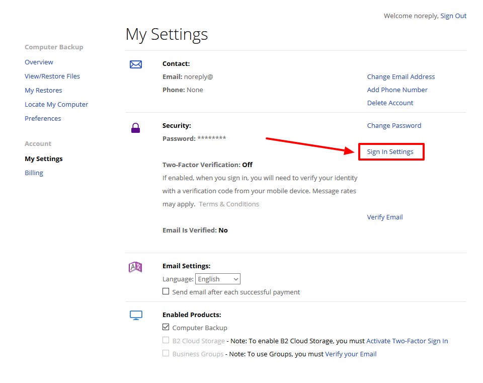
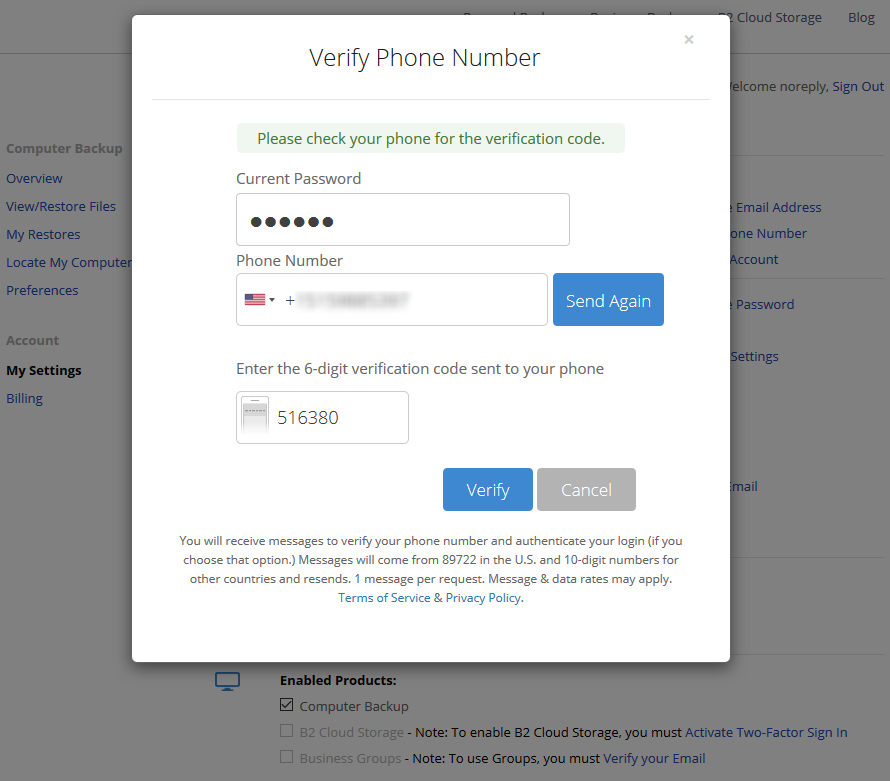
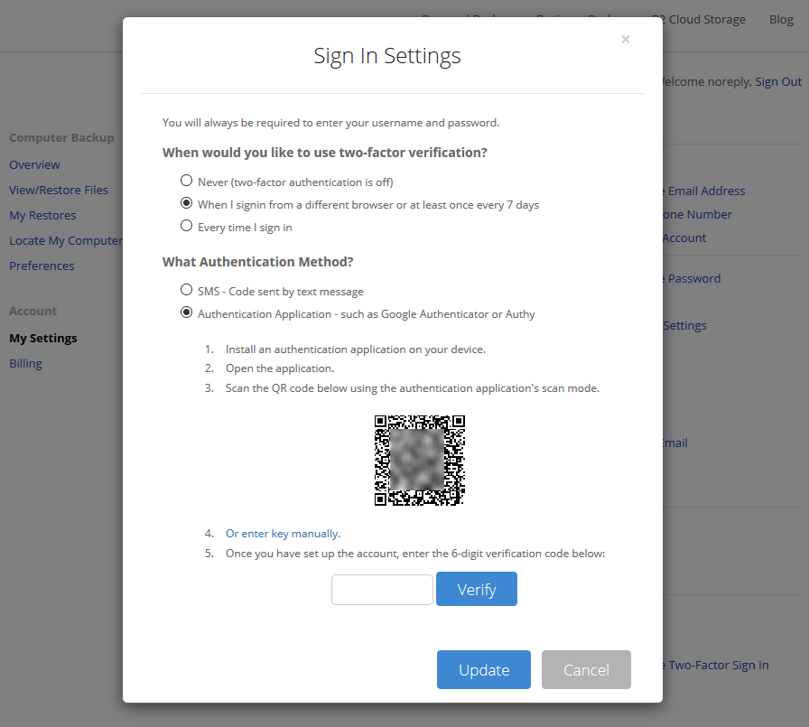
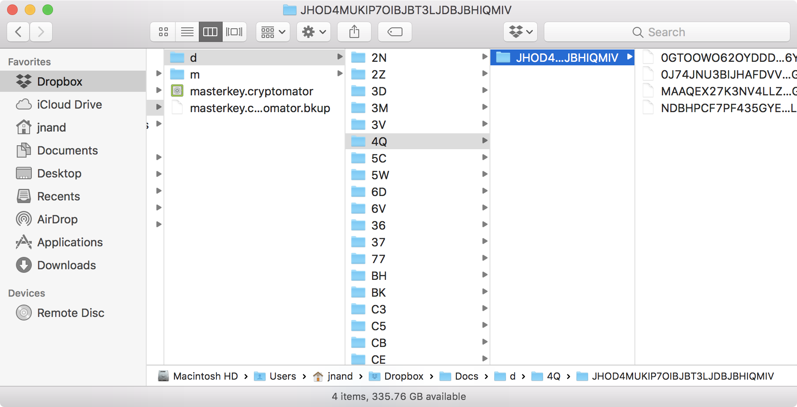

Backup & Recovery
==================

With our system now encrypted we need to maintain a secure and auditable backup. If you have a backup system already in place, you can skip the related sections, otherwise this guide will continue with recommendations based on our threat model and price considerations.


Cloud Backup
------------

Our main requirements are :

- [ ] **Resilience**  
    _We'd like to either have access to multiple separate copies, or have the host provide some kind of fault tolerance_
- [ ] **Encryption**  
    _Data should be encrypted client-side and send to cloud storage_
- [ ] **Two factor auth**  
    _The service should offer a second factor option_
- [ ] **Versioning**  
    _Files should have an auditable history_
- [ ] **Cost**  
    _Pricing should be relatively cheap, for upwards of >1TB_
- [ ] **Continuous backup**  
    _The solution should listen to system file change events and batch upload data as needed vs a scheduled backup strategy_


After considering a few solutions, [Backblaze](https://www.backblaze.com/cloud-backup.html), is our choice given its feature set, price, unlimited storage, and ease of use. Alternatively, for a more secure but size priced service look into [Tarsnap](https://www.tarsnap.com/). 

### Backblaze ###

Install backblaze via, `❯ brew install caskroom/cask/backblaze`

Backblaze will install a **System Preferences** pane,



It defaults to continuously backup your system, automatically throttling cpu and bandwidth as needed (this is adjustable if performance becomes an issue).

!> Click the **Settings** button in the backblaze pane, got to **Security**, and click **"Enter Your Private Encryption Key"**. Use KeePassXC to generate a secure key.

<div class="center" style="width: 600px">

</div>


#### Two factor auth ####

> When you log in to your [Backblaze](https://secure.backblaze.com/user_signin.htm) account, on the left-hand side go to “My Settings”, and navigate towards the middle of the page where you will see your “Sign-In Settings”, click on that to make the change.



Enter your phone number to enable two-factor, 



Register your Authenitcator App,




### Dropbox ###

For shared documents and files dropbox is great, and after creating a cryptomator vault, should be secure method for keeping multiple copies of important files across systems. Dropbox also keeps versioned copies, which can be rolled-back for revision control. However if you need [zero knowledge encryption](https://tresorit.com/blog/zero-knowledge-encryption/) look at [SpiderOak](https://spideroak.com/) or [tresorit](https://tresorit.com/).

#### Cryptomator ####

If you setup cyptomator in the [Encrypted Volumes](pages/crypto/volumes?id=cryptomator) section, your Dropbox backed vaults should be obfuscated when unmounted.




#### Two factor auth ####

Dropbox supports U2F, and can use the yubikey as a second factor. 

[Enable 2FA](https://www.dropbox.com/help/security/enable-two-step-verification/#enable)

1. [Sign in](https://www.dropbox.com/login) to dropbox.com.
2. Click your avatar.
3. Choose Settings.
4. Select the Security tab.
5. Toggle Two-step verification to On.  
    5.1 Click Get started.  
    5.2 Re-enter your password.  
    5.3 Choose if you want to receive your security code by text message or mobile app  
6. Under Two-step verification, click Show next to Recovery codes and save to your keychain
7. Under Two-step verification, click Add next to Security keys.        
    7.1 Enter your password  
    7.2 Insert your security key into a USB port, then click Begin setup.  
    7.3 Continue the wizard.  
    

---

Secure backup
--------------

Given all the effort to secure and encrypt sensitive data, we have yet to develop a recovery strategy in the unfortunate event of a system fault.

### Online backup ###

We can create a secure online backup of `~/Secrets` via [keybase encrypted repos](https://keybase.io/blog/encrypted-git-for-everyone). 

1. Open the keybase app, `❯ open /Applications/Keybase.app`
2. Create a secure repo, `❯ keybase git create secrets`
3. Checkout, `❯ git clone keybase://private/<USERNAME>}/secrets ~/Secrets`

Now every time you push to origin, the keybase git [remote helper](https://git-scm.com/docs/git-remote-helpers) will encrypt your data using your private key, with all the features of keybase and zero knowledge encryption.


### Relocate ###

We have private keys and sensitive data in many locations across the system, for ease of management lets consolidate these into `~/Secrets` and symlink the original location.

Check these paths for files to move:

- [ ] **keypass.kdbx**  
    _KeePassXC secure keychain_
- [ ] **public-key.gpg**, **private-key.gpg**, **private-subkeys.gpg**  
    _ASCII format GnuPG keyfile exports from earlier_
- [ ] **keyfiles**. 
    _these are 10 1kb keyfiles generated during prep_
- [ ] **~/.ssh/*.pub**  
    _public keys_
- [ ] **~/.ssh/*.priv**  
    _private keys_
- [ ] **~/.ssh/host.config**  
    _host specific ssh configs, `included` in the main config_
- [ ] **~/.gnupg/private-keys*/***  
    _private keys_
- [ ] **~/.gnupg/pubring.***  
    _gnu keyring_
- [ ] **~/.gnupg/trustdb.**  
    _trusted keys_
- [ ] **~/.yubico**  
    _yubico challenge response key_
- [ ] **yubikey slot 2 challenge-response HMAC-SHA1 secret**  
    _in case you need to recover your yubikey config without access to your keychain_.  
    - save your secret to a text file, `yubikey-slot2.txt`.
    - encrypt with **Level I** or a new password, `❯ gpg --symmetric yubikey-slot2.txt`
    - destroy `yubikey-slot2.txt`  
    _note this will again be encrypted by kebase/veracrypt_

?> <i class="far fa-bell"></i> Remember to commit and push to your keybase repo.


### Offline backup ###

Now that everything is consolidated in `~/Secrets`, lets create an offline backup.

Using the veracrypt wizard create a small volume, ~100MB. You can use a hidden volume strategy for extra security, but note the [additional handling](https://archive.codeplex.com/?p=veracrypt) needed to prevent corruption.

<div class="center" style="width: 600px">

</div>


- Create the volume using your **Level III** passphrase and a **keyfile**.
- Copy `~/Secrets` into the volume, and dismount.
- Store a copy of the volume on USB flash drive in a secure location.

---

Restoring Secrets
------------------

Restoring `~/Secrets` should only be matter of cloning the keybase repo or unlocking and extracting the veracypt volume and symlinking the appropriate paths.

### Keepass db ###

Recovering the keepass database is a bit more involved. These instructions will assume a "total loss", where even your yubikey is inoperable.

Because KeePassXC uses a composite key to authenticate we'll need to recover the challenge-response HMAC-SHA1 secret and then remember our **Level II** passphrase, pairing it with the appropriate keyfile (which should be available in our restored `~/Secrets` folder).

Recover the HMAC-SHA1 secret, `❯ gpg --decrypt yubikey-slot2.txt.gpg`

```stdout
00 00 00 00 00 00 00 00 00 00 00 00 00 00 00 00 00 00 00 00
```

Configure your replacement yubikey with the restored secret key.


### GPG Keys ###

See [Importing keys](pages/crypto/gnupg?id=importing-keys) in the crypto section. Follow the same instruction, except import into the main keyring.


