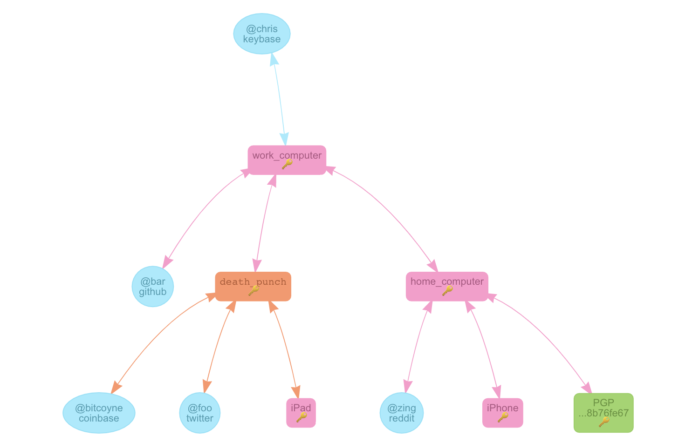

Keybase
========

> Keybase is a key directory that maps social media identities to encryption keys (including, but not limited to PGP keys) in a publicly auditable manner. Keybase also offers an encrypted chat and cloud storage system, called Keybase Chat and the Keybase filesystem respectively.

You can create a keybase account at <https://keybase.io/>. The client is also installable via homebrew, `❯ brew install caskroom/cask/keybase`. Keybase is great for hosting public keys; PGP is supported natively, but SSH keys can be made available via their public share folder. Once shared they can easily be added to new hosts via `wget https://jnand.keybase.pub/ssh-public.keys`.

Keybase has a scriptable platform, robust suite of command line tools, and developer api which makes it quite versatile.

?> **Note:** Keybase will install a menubar icon and a _sshfuse_ like extension.

    <strong><u>Keybase application</u></strong>
    

    <em>macOS & iOS</em>

?> Keybase uses device specific keys and publicly verifiable social proofs to build a web of trust validating your identity.

    <strong><u>Keybase graph</u></strong>
    

    <em>here we see a user with 4 computers (2 are mobile) and 6 keys; she even used her paper key to provision a device! the important thing is that she is herself, the sum of all her proofs, on any device</em>

