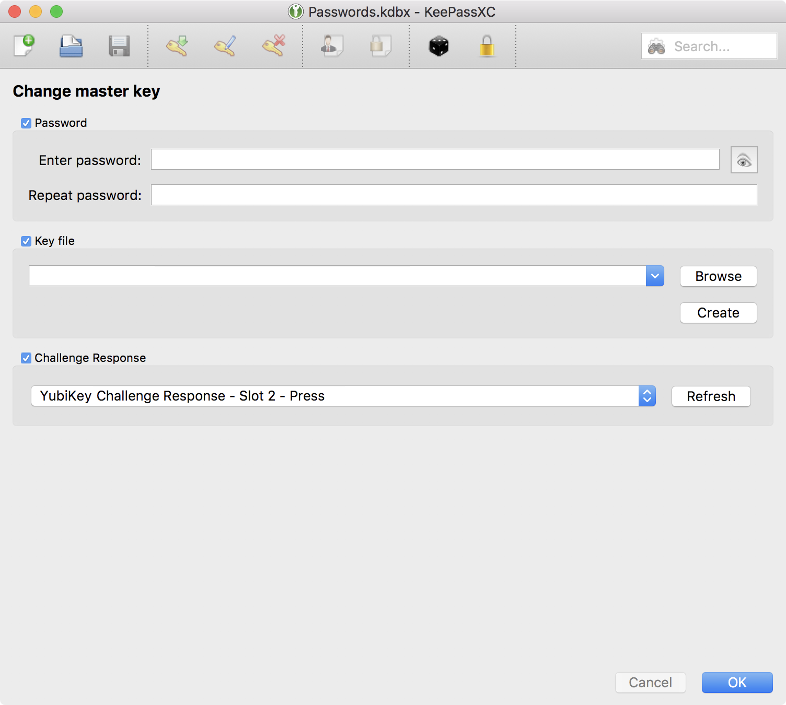

Keychain <i class="fas fa-lock"></i>+
==========

To improve the security of our keychain further, we'll add our yubikey to the composite key. 

Open KeePassXC, go to **"Database"**, then **"Change master key ..."**.  
Enter your **Level II** passphrase, selected **keyfile**, and insert the yubikey.  
Check all three components and click OK.

?> **Note** the yubikey should blink, prompting for a keypress -- _configured previously_

