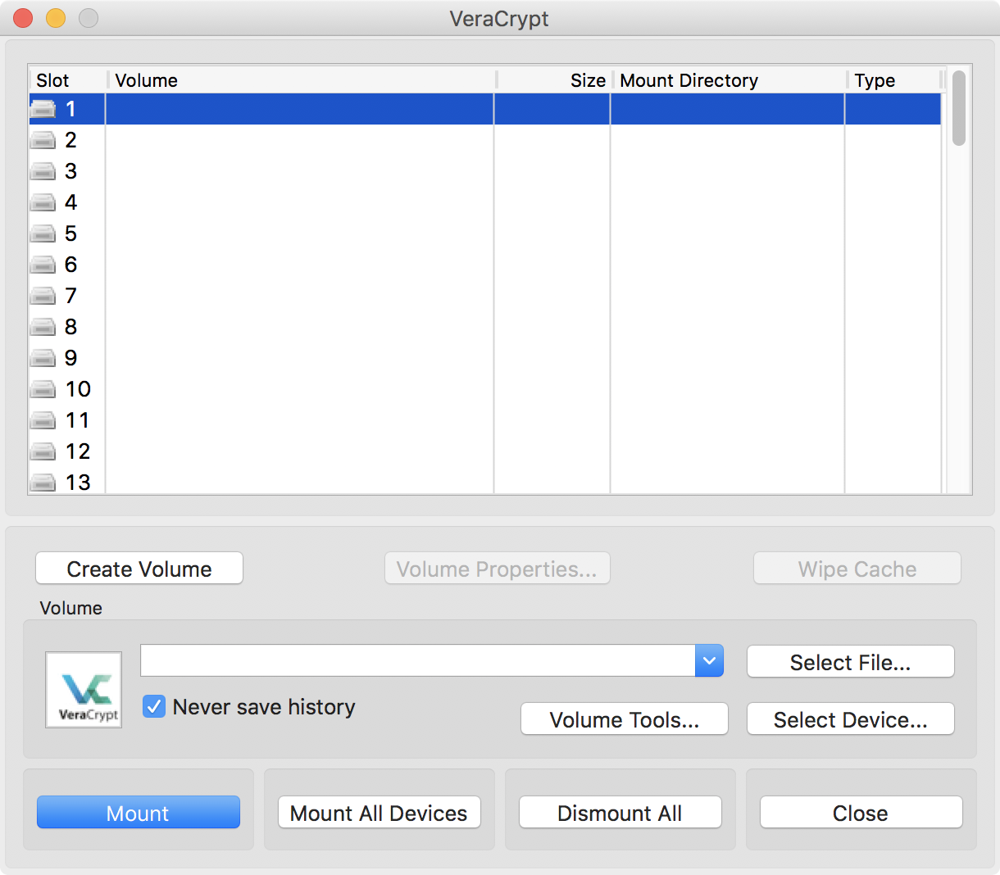
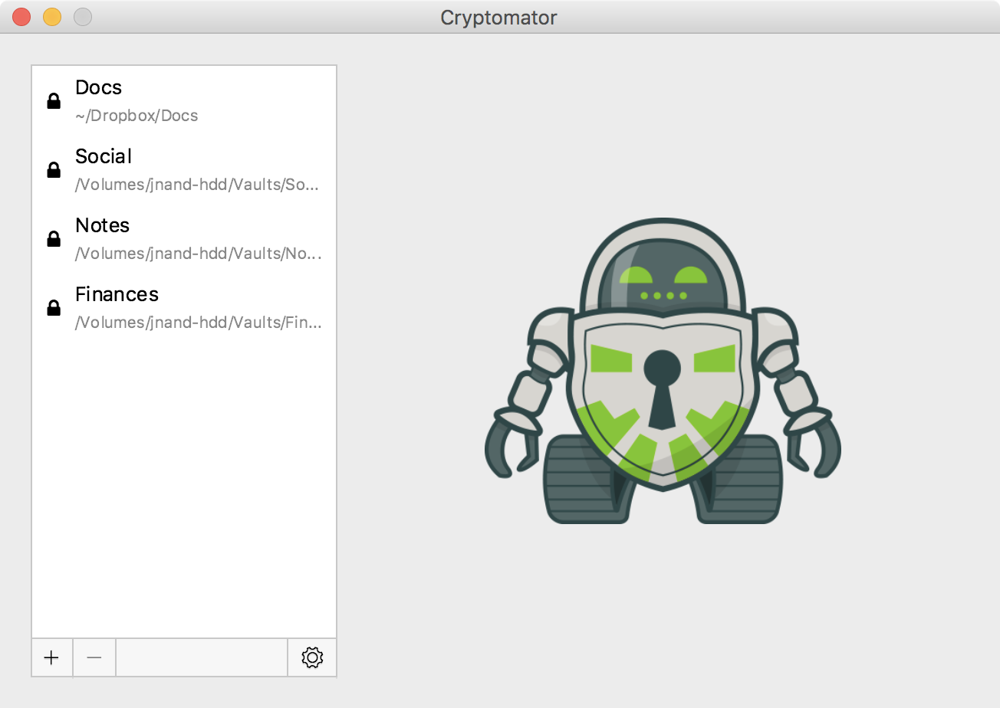
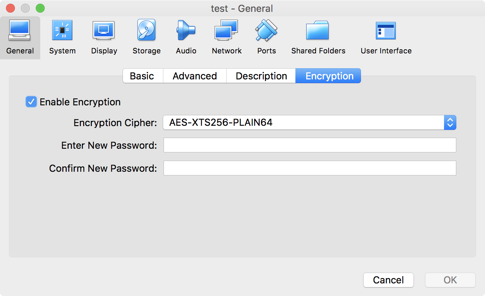
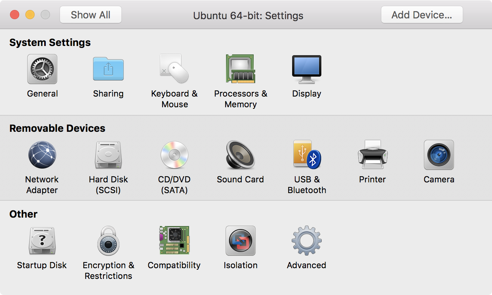
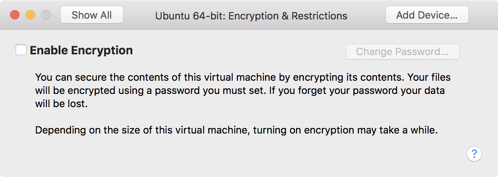

Encrypted volumes
==================

Encrypting data at rest is essential to resolving many of the security issues discussed in our model. Our strategy will be layered, so that sensitive data can be protected both locally and in the cloud.

FileVault
---------

For this guide FileVault uses an install time provided key for encryption, our **Level III** passphrase. It uses the XTS mode of AES with 128 bit blocks and a 256 bit key to encrypt the disk, as recommended by NIST. This mode of operation is described by Apple as _Disk Password-based DEK_

- there is a passphrase for the volume
- the clean system will immediately behave as if FileVault was enabled after installation
- there is no recovery key, but the system will behave as if a key was created
- Disk Password will appear at the EfiLoginUI
- the running system will present the traditional login window.

### Full Disk Encryption ###

Check if FileVault is on, `❯ sudo fdesetup status`

```stdout
FileVault is On.
```

Enable it if needed, `❯ sudo fdesetup enable`.

?> If you're ssh'ed into a machine with FileVault, and need to restart, you can use `❯ sudo fdesetup authrestart` to reboot and unlock the disk with the current FVKey.


### Mounting non system volumes ###

If you have external FileVault drives attached to a remote system, or need to script the ability to mount, use `[diskutil](http://www.applegazette.com/mac/pro-terminal-commands-using-diskutil/)`.

Find the Logical Volume UUID,  `❯ diskutil list`

```stdout
/dev/disk0 (internal, physical):
   #:                       TYPE NAME                    SIZE       IDENTIFIER
   0:      GUID_partition_scheme                        *320.1 GB   disk0
   1:                        EFI EFI                     209.7 MB   disk0s1
   2:          Apple_CoreStorage System                  319.2 GB   disk0s2
   3:                 Apple_Boot Recovery HD             650.0 MB   disk0s3

...

/dev/disk4 (external, virtual):
   #:                       TYPE NAME                    SIZE       IDENTIFIER
   0:                 Apple_HFSX jnand-hdd              +7.0 TB     disk4

Offline
                                 Logical Volume jnand-hdd on disk2s4
                                 AB38F577-085B-4CE5-8F14-F608A47CBF54
                                 Locked Encrypted
```

Unlock the volume, `❯ diskutil coreStorage unlockVolume <UUID>`, _AB38F577-085B-4CE5-8F14-F608A47CBF54_

```stdout
Started CoreStorage operation
Logical Volume successfully unlocked
Logical Volume successfully attached as disk5
Logical Volume successfully mounted as /Volumes/jnand-tmn
Core Storage disk: disk5
Finished CoreStorage operation
```

Mount the disk, `❯ diskutil mount <diskN>`, _disk5_

```stdout
Volume jnand-hdd on disk5 mounted
```


VeraCrypt
---------

For cases were a portable encrypted volume is needed, we'll use [VeraCrypt](https://www.veracrypt.fr/code/VeraCrypt/) a fork of the discontinued TrueCrypt project. VeraCrypt has clients for all major platforms and supports many different encryption schemes.

Install VeraCrypt, `❯ brew install caskroom/cask/veracrypt`.



VeraCrypt has a wizard to help with creating new volumes.


?> VeraCrypt supports plausible deniability by allowing a single "hidden volume" to be created within another volume.

In this mode VeraCrypt will create two encryptions schemes with two different keys. In the event you're compelled to decrypt the volume you can supply the primary key. If **[properly maintained](https://www.veracrypt.fr/en/Security%20Requirements%20for%20Hidden%20Volumes.html)** the hidden second volume will appear as random empty space within the first.

!> For security reasons do not store your VeraCrypt volumes on a versioned cloud host like dropbox, as this weakens the security provided by a hidden volume


Cryptomator
-----------

[Cryptomator](https://cryptomator.org/) is different form VeraCrypt in that it encrypts individual files, which makes it especially useful for cloud storage. Additionally, it encrypts file names, so if someone does access your cryptomator "vault" folder no information is leaked by filenames. However, cryptomator only offers AES, and does not provide "plausible deniability".


Install with homebrew, `❯ brew install caskroom/cask/cryptomator`



When unlocked, Cryptomator provides a virtual hard drive through which you can access your files, encrypting files client side via AES-XTS.


Virtual machines
-----------------

Both VirtualBox and VMware Fusion support encrypting VM disks. This is important when the client work is isolated in a VM contains sensitive data, and should be secured separately from the host system's disk encryption.

### VirtualBox ###

Encryption can be set by selecting the VM image in the manager, and opening its settings pane.

<div class="center" style="width: 600px">
    
</div>

### VMWare Fusion ###

In Fusion, encryption has its own preferences pane, accessible through the VM images settings.

<div class="center" style="width: 600px">
    
    
</div>  

