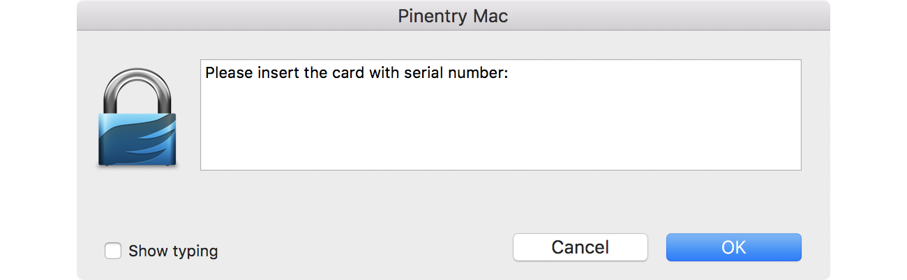
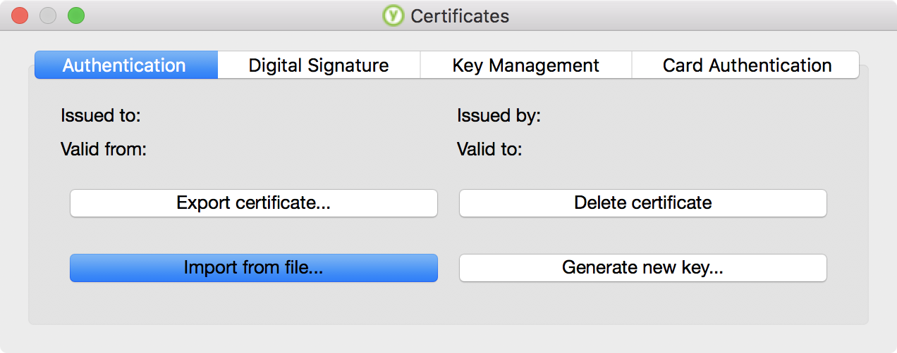
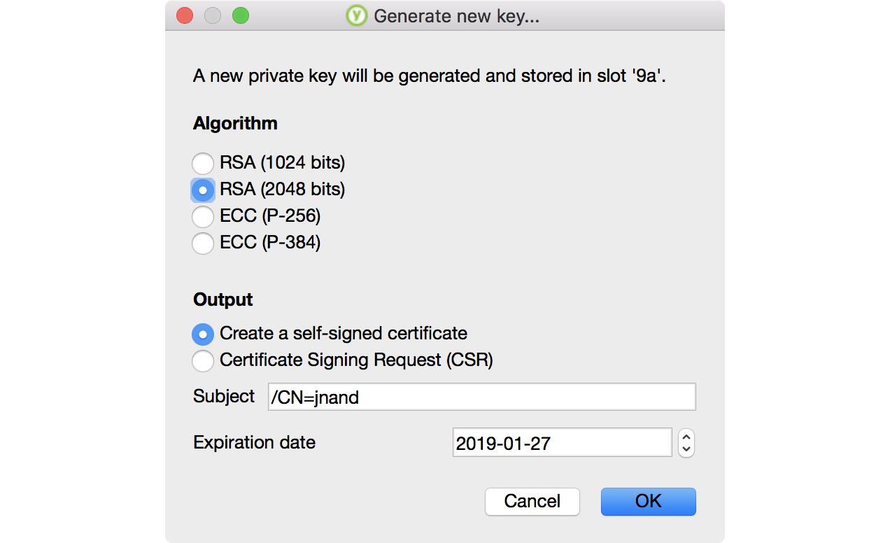
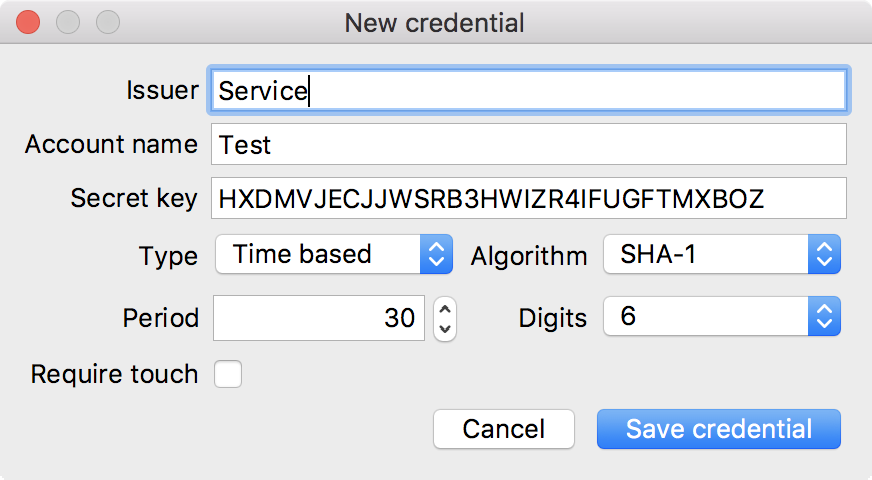
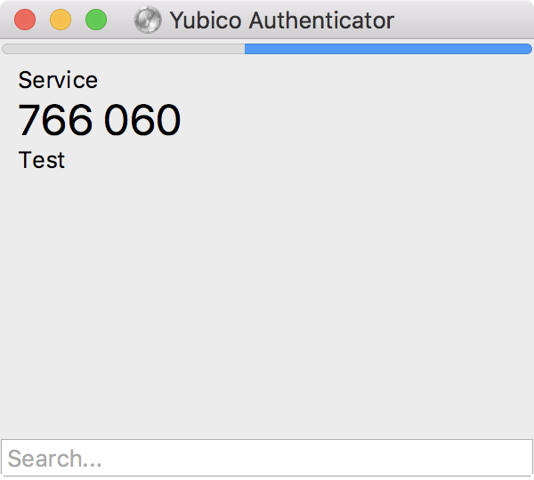

YubiKey 
========

Now that we have our GPG keys, we can move them onto the yubikey, effectively creating an off-system hardware token. Afterwards, we'll add X.509 certificates for use with secure communications -- _e.g. VPN etc._, then finish integrating the device with the rest of the system.


Loading GPG keys
------------------

?> If you need to update a PIN code via the gpg card manager follow the example in the infobox below. **Note:** the Yubikey PIV tool is the preferred method.

```info
gpg/card> passwd
gpg: OpenPGP card no. D2760001240102010006069405960000 detected

1 - change PIN
2 - unblock PIN
3 - change Admin PIN
4 - set the Reset Code
Q - quit

Your selection? 3
PIN changed.

1 - change PIN
2 - unblock PIN
3 - change Admin PIN
4 - set the Reset Code
Q - quit

Your selection? 1
PIN changed.

1 - change PIN
2 - unblock PIN
3 - change Admin PIN
4 - set the Reset Code
Q - quit

Your selection? q
```

### Add card info ###

`❯ gpg --card-edit`

```stdout
Reader ...........: Yubico Yubikey 4 OTP U2F CCID
Application ID ...: D2760001240102010006069405960000
Version ..........: 2.1
Manufacturer .....: Yubico
Serial number ....: 0*******
Name of cardholder: [not set]
Language prefs ...: [not set]
Sex ..............: unspecified
URL of public key : [not set]
Login data .......: [not set]
Signature PIN ....: not forced
Key attributes ...: rsa4096 rsa4096 rsa4096
Max. PIN lengths .: 127 127 127
PIN retry counter : 3 3 3
Signature counter : 0
Signature key ....: [none]
Encryption key....: [none]
Authentication key: [none]
General key info..: [none]
```

Confirm administration is allowed: `gpg/card> admin`

```stdout
Admin commands are allowed
```

Set the owner name: `gpg/card> name`

```gpg
Cardholder's surname: 
Cardholder's given name: 
```

Set the locale: `gpg/card> lang`, to **`en`**

```gpg
Language preferences: 
```

Set the login account: `gpg/card> login`, to your **`email`**

```gpg
Login data (account name): 
```

Verify the card info is correct `gpg/card> (Press Enter)`

```stdout
Application ID ...: D2760001240102010006055532110000
Version ..........: 2.1
Manufacturer .....: unknown
Serial number ....: 0*******
Name of cardholder: First Last
Language prefs ...: en
Sex ..............: unspecified
URL of public key : [not set]
Login data .......: username@email.com
Private DO 4 .....: [not set]
Signature PIN ....: not forced
Key attributes ...: rsa4096 rsa4096 rsa4096
Max. PIN lengths .: 127 127 127
PIN retry counter : 3 3 3
Signature counter : 0
Signature key ....: [none]
Encryption key....: [none]
Authentication key: [none]
General key info..: [none]
```

Exit `gpg/card> quit`


### Move GPG keys ###

Start a gpg session `❯ gpg --edit-key <KEY ID>`, _AA78C02FE62BF171_

```stdout
gpg (GnuPG) 2.2.1; Copyright (C) 2017 Free Software Foundation, Inc.
This is free software: you are free to change and redistribute it.
There is NO WARRANTY, to the extent permitted by law.

Secret key is available.

pub  rsa4096/0xAA78C02FE62BF171
     created: 2018-01-01  expires: never       usage: SC
     trust: ultimate      validity: ultimate
ssb  rsa4096/0xE37883053D51C06F
     created: 2018-01-01  expires: never       usage: E
     card-no: 0000 00000000
ssb  rsa4096/0xDCCDCA5907863E7D
     created: 2018-01-01  expires: never       usage: S
     card-no: 0000 00000000
ssb  rsa4096/0x7666562DB1D05A07
     created: 2018-01-01  expires: never       usage: A
     card-no: 0000 00000000
[ultimate] (1). ----- <-----@---.com>
[ultimate] (2)  [jpeg image of size 5439]
```

#### Encrypt subkey ####

Select the **`[E]`** subkey, `gpg> key 1`, where **`1`** is the ordered number of the key as listed by gpg.

```stdout
sec  rsa4096/0xAA78C02FE62BF171
    created: 2018-01-01  expires: never       usage: SC
    trust: ultimate      validity: ultimate
ssb* rsa4096/0xE37883053D51C06F
    created: 2018-01-01  expires: never       usage: E
ssb  rsa4096/0xDCCDCA5907863E7D
    created: 2018-01-01  expires: never       usage: S
ssb  rsa4096/0x7666562DB1D05A07
    created: 2018-01-01  expires: never       usage: A
[ultimate] (1). ----- <-----@---.com>
[ultimate] (2)  [jpeg image of size 5439]
```

Notice how the key in position 1 is marked by an asterix, **`ssb*`**. 

Move the key, `gpg> keytocard`

```gpg
Please select where to store the key:   
   (2) Encryption key   
```

Enter: "Your selection?", **`2`**, "Encryption key"


#### Signing subkey ####

Unselect the **`[E]`** subkey, `gpg> key 1`.

Select the **`[S]`** subkey, `gpg> key 2`

```stdout
sec  rsa4096/0xAA78C02FE62BF171
    created: 2018-01-01  expires: never       usage: SC
    trust: ultimate      validity: ultimate
ssb  rsa4096/0xE37883053D51C06F
    created: 2018-01-01  expires: never       usage: E
ssb* rsa4096/0xDCCDCA5907863E7D
    created: 2018-01-01  expires: never       usage: S
ssb  rsa4096/0x7666562DB1D05A07
    created: 2018-01-01  expires: never       usage: A
[ultimate] (1). ----- <-----@---.com>
[ultimate] (2)  [jpeg image of size 5439]
```

Move the key, `gpg> keytocard`

```gpg
gpg> keytocard
Please select where to store the key:
   (1) Signature key
   (3) Authentication key
```

Enter: "Your selection?", **`1`**, "Signature key"

#### Authentication subkey ####

Unselect the **`[S]`** subkey, `gpg> key 2`.

Select the **`[A]`** subkey, `gpg> key 3`

```stdout
sec  rsa4096/0xAA78C02FE62BF171
    created: 2018-01-01  expires: never       usage: SC
    trust: ultimate      validity: ultimate
ssb  rsa4096/0xE37883053D51C06F
    created: 2018-01-01  expires: never       usage: E
ssb  rsa4096/0xDCCDCA5907863E7D
    created: 2018-01-01  expires: never       usage: S
ssb* rsa4096/0x7666562DB1D05A07
    created: 2018-01-01  expires: never       usage: A
[ultimate] (1). ----- <-----@---.com>
[ultimate] (2)  [jpeg image of size 5439]
```

Move the key, `gpg> keytocard`

```gpg
gpg> keytocard
Please select where to store the key:
   (3) Authentication key
```

Enter: "Your selection?", **`3`**, "Authentication key"

**Save**, `gpg> save`

#### Confirm changes ####

Check, `❯ gpg -K <KEY ID>`, _AA78C02FE62BF171_

```stdout
sec#  rsa4096/0xAA78C02FE62BF171 2018-01-01 [SC]
      Key fingerprint = E2DC D9A8 62D8 9D4C 1D91  5469 AA78 C02F E62B F171
uid           [ultimate] ----- <-----@---.com>
uid           [ultimate] [jpeg image of size 5439]
ssb>  rsa4096/0xE37883053D51C06F 2018-01-01 [E]
ssb>  rsa4096/0xDCCDCA5907863E7D 2018-01-01 [S]
ssb>  rsa4096/0x7666562DB1D05A07 2018-01-01 [A]
```

Notice how the secret subkeys (ssb) now have a `>` next to them; they now exist offline on the yubikey.

#### Require key press ####

Ensure the user is made aware when any private key is read.

`❯ ykman openpgp touch aut on`  
`❯ ykman openpgp touch sig on`  
`❯ ykman openpgp touch enc on`  

### Test run ###

Run a quick end-to-end sanity check.

`❯ echo "$(uname -a)" | gpg --encrypt --sign --armor --recipient AA78C02FE62BF171 | gpg --decrypt --armor`




```stdout
gpg: using "E2DCD9A862D89D4C1D915469AA78C02FE62BF171" as default secret key for signing
gpg: encrypted with 4096-bit RSA key, ID 0xE37883053D51C06F, created 2018-01-01
      "----- <-----@---.com>"
Darwin zebra.local 17.4.0 Darwin Kernel Version 17.4.0: Sat Jan 01 00:00:01 PST 2018; root:xnu-4570.41.2~1/RELEASE_X86_64 x86_64
gpg: Signature made Sat Jan 01 00:00:01 2018 PST
gpg:                using RSA key 3B3FBC948FE59301ED629EFB6AE6D7EE46A871F8
gpg: Good signature from "----- <-----@---.com>" [ultimate]
gpg:                 aka "[jpeg image of size 5439]" [ultimate]
Primary key fingerprint: E2DC D9A8 62D8 9D4C 1D91  5469 AA78 C02F E62B F171
```

### Troubleshooting

* [Resetting OpenPGP PIN retries](https://www.yubico.com/support/knowledge-base/categories/articles/reset-applet-yubikey/)


---

X.509 Certificates
-------------------

Open the PIV manager, and start the "Certificates" tool.

`❯ open /Applications/YubiKey\ PIV\ Manager.app`




Generate certificates or each of the types, exporting a copy for storage in your keychain: 

- [ ] "Authentication"
- [ ] "Digital Signature"
- [ ] "Key Management"
- [ ] "Card Authentication"

Each should be **`RSA(2048 bits)`** and **`self-signed`**.



---

System Integration
------------------

### User logon ###

Now we're going to integrate the yubikey with macOS's logon authentication. We'll do this via the Pluggable Authentication Module (PAM) extension. [oem guide](https://www.yubico.com/support/knowledge-base/categories/articles/yubikey-mac-os-x-login-guide/)

?> **Scenario:**  
-1- The user powers on the macbook, and FileVault prompts to unlock the disk.  
... _User enters a pepper, followed by a yubikey keypress, followed by a Level III passphrase_.  
-2- MacOS prompts for user logon.  
... _User enters username, followed by a Level I passphrase, presses <Return>_.  
-3- System initiates a challenge-response sequence, yubikey starts to blink.  
... _User presses yubikey, and successfully logs on_.  
... _without the yubikey present, logon would fail_.  

In this section we'll be configuring macOS for step -3- of the user story.

#### FileVault ####

To cooperate with FDE, we need to disable user logon authentication from also unlocking the disk. This increases the robustness of our encryption and authentication schemes, but is also needed to allow [HMAC](https://en.wikipedia.org/wiki/Hash-based_message_authentication_code) generation during macOS logon **and** allow FileVault. This because the PAM extensions are not available pre-os when unlocking the disk.

!> Leaving FDEAutoLogin enabled may lock you out of the system, requiring a [single-user-mode](https://support.apple.com/en-us/HT201573) workaround.

`❯ sudo defaults write /Library/Preferences/com.apple.loginwindow DisableFDEAutoLogin -bool YES`


#### Drivers ####

Earlier we `brew` installed the `pam_yubico` package. Lets verify everything is ready.

`❯ ls /usr/local/lib/security`

```stdout
pam_yubico.so
```

#### Configure Challenge Response Logon ####

- [ ] Create a config dir for the yubikey. `❯ mkdir –m0700 –p ~/.yubico`
- [ ] Insert the yubikey
- [ ] Generate the config. `❯ ykpamcfg -2`

Confirm the challenge token was created.

`❯ cat /Users/[USERNAME]/.yubico/challenge-*[YUBIKEY SERIAL NUMBER]*`


#### Update Auth Config ####

!> Before continuing, make sure you have a system backup, these changes can lock you out of your user account. Be sure to have access to your keychain in case you need the firmware password to get into [single-user-mode](https://support.apple.com/en-us/HT201573).


To require the yubikey when unlocking the screen or waking from sleep add the line 

```config
auth required /usr/local/lib/security/pam_yubico.so mode=challenge-response
```

to _/etc/pam.d/screensaver_, `❯ sudo vi /etc/pam.d/screensaver`


```/etc/pam.d/screensaver
# screensaver: auth account
auth       optional       pam_krb5.so use_first_pass use_kcminit
auth       required       pam_opendirectory.so use_first_pass nullok
auth       required       /usr/local/lib/security/pam_yubico.so mode=challenge-response
account    required       pam_opendirectory.so
account    sufficient     pam_self.so
account    required       pam_group.so no_warn group=admin,wheel fail_safe
account    required       pam_group.so no_warn deny group=admin,wheel ruser fail_safe
```

To require yubikey for new logons and/or auth sessions add the same line to _/etc/pam.d/authorization_

`❯ sudo vi /etc/pam.d/authorization`

```/etc/pam.d/authorization
# authorization: auth account
auth       optional       pam_krb5.so use_first_pass use_kcminit
auth       optional       pam_ntlm.so use_first_pass
auth       required       pam_opendirectory.so use_first_pass nullok
auth       required       /usr/local/lib/security/pam_yubico.so mode=challenge-response
account    required       pam_opendirectory.so
```

?> This will **not** require the yubikey for sudo, as intended, to ease frequent command line use. Note: the system should not have any remote access services running via this guide *e.g* sshd, vnc, etc.

Now log out and try singing back in, with and without the yubikey.

---

### SSH + GPG ###

Lets configure `ssh` to use our GPG keys via `gpg-agent`.

#### Configuration ####

Ensure _~/.gnupg/gpg-agent.conf_ is setup to use the yubikey, `❯ vi /.gnupg/gpg-agent.conf`

?> Get the path of pinentry-mac if needed, `❯ which pinentry-mac`

```/.gnupg/gpg-agent.conf 
enable-ssh-support
default-cache-ttl 600
max-cache-ttl 7200
pinentry-program /usr/local/bin/pinentry-mac
```

Update your rc file to include the env vars:

```bash
export "GPG_TTY=$(tty)"
export "SSH_AUTH_SOCK=${HOME}/.gnupg/S.gpg-agent.ssh"
```

#### Authorized keys ####

1. Insert the yubikey.

2. Make sure gpg-agent is running, `❯ gpg-agent`

    ```stdout
    gpg-agent[90017]: gpg-agent running and available
    ```

3. **On each host**, trust the GPG auth key, `❯ ssh-add -L | grep -iF 'cardno' >> ~/.ssh/authorized_keys`
4. Confirm the key is now present, `❯ cat ~/.ssh/authorized_keys`


---

### FIDO U2F ###

Universal Second Factor enables challenge-response style authentication for applications/services implementing the standard. For more information on cloud services compatible with U2F check the [yubico website](https://www.yubico.com/solutions/fido-u2f/).

Support includes:

- Google
- Facebook
- Salesforce
- GitHub
- Bitbucket
- GitLab
- Dropbox
- Dashlane

<div class="center">
    <strong><u>How it works.</u></strong>
    <p></p>
    <em>U2F process flow</em>
</div>

> U2F Security Keys are supported by Google Chrome since version 38 and Opera since version 40. U2F security keys can be used as an additional method of two-step verification on online services that support the U2F protocol, including Google, Dropbox, GitHub, GitLab, Bitbucket, Nextcloud, Facebook and others.

---

Authenticator
--------------

Yubico also provides an [authenticator app](https://www.yubico.com/support/knowledge-base/categories/articles/yubico-authenticator-download/) for 2FA-TOTP.

If not already installed, `❯ brew install caskroom/drivers/yubico-authenticator`

### Add a new TOTP ###

1. Start the authenticator, `❯ open /Applications/Yubico\ Authenticator.app`
2. Plug in the yubikey
3. Open the setup page for the service using TOTP
4. In the Yubico Authenticator go to **File**, **Scan QR code**  
    _the authenticator will scan the screen for QR codes and populate an entry_
    <div style="width: 450px">
    
    </div>
5. The TOTP credentials will now show in the app whenever the yubikey is plugged in.  
    <div style="width: 450px">
    
    </div>


