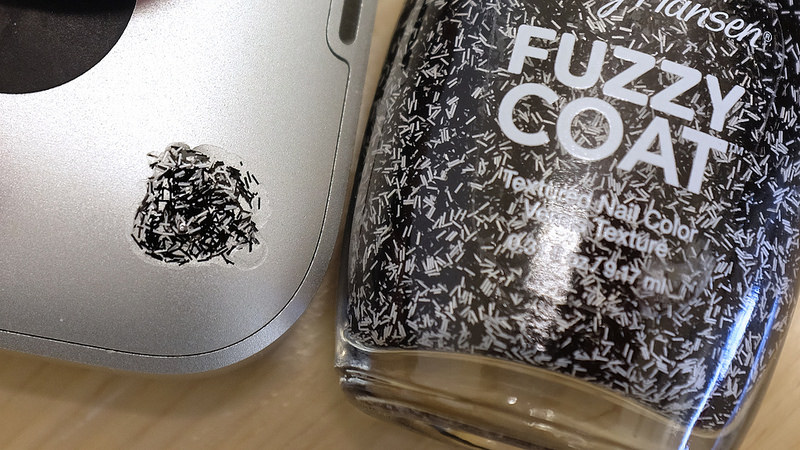
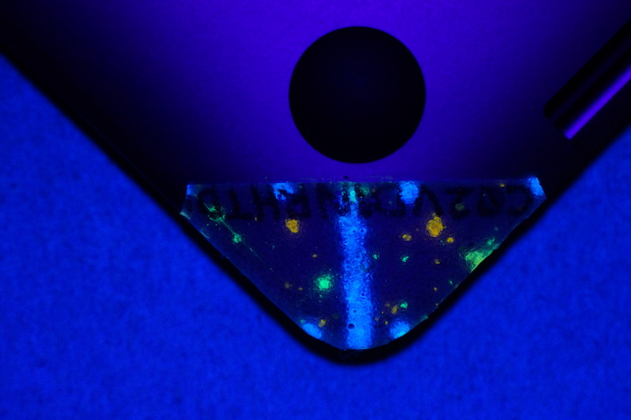
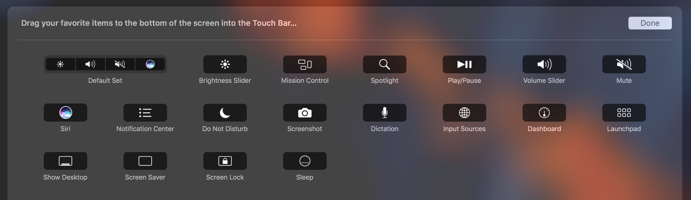
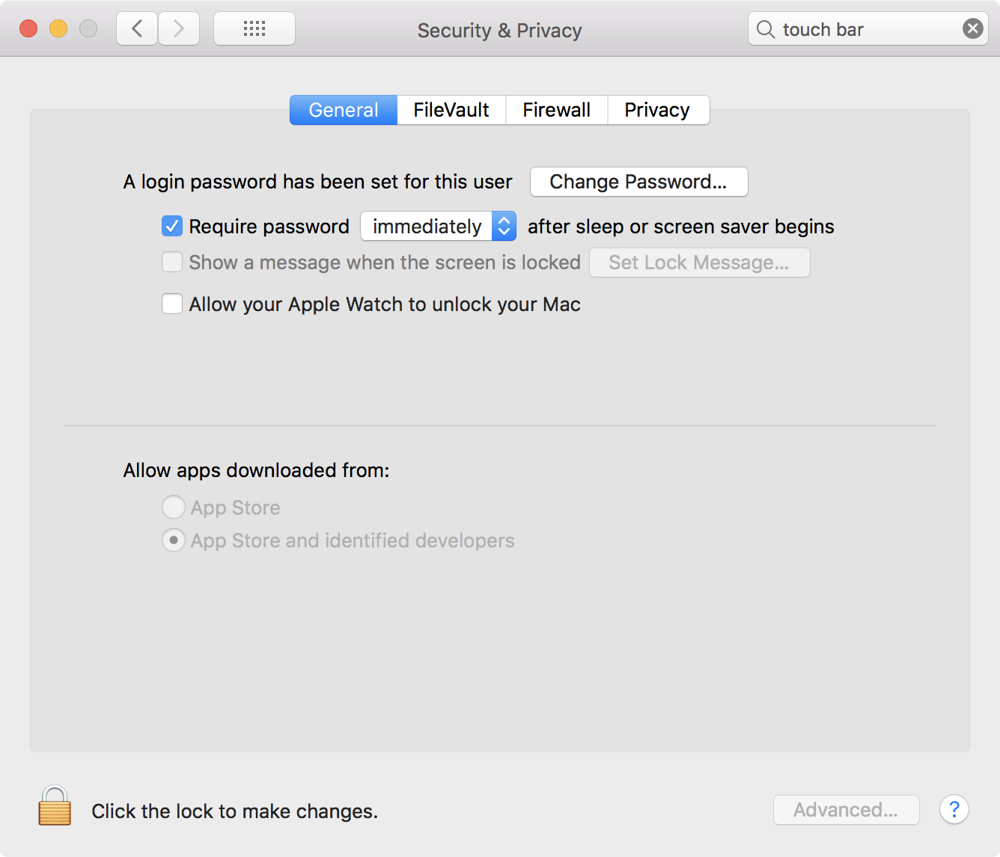
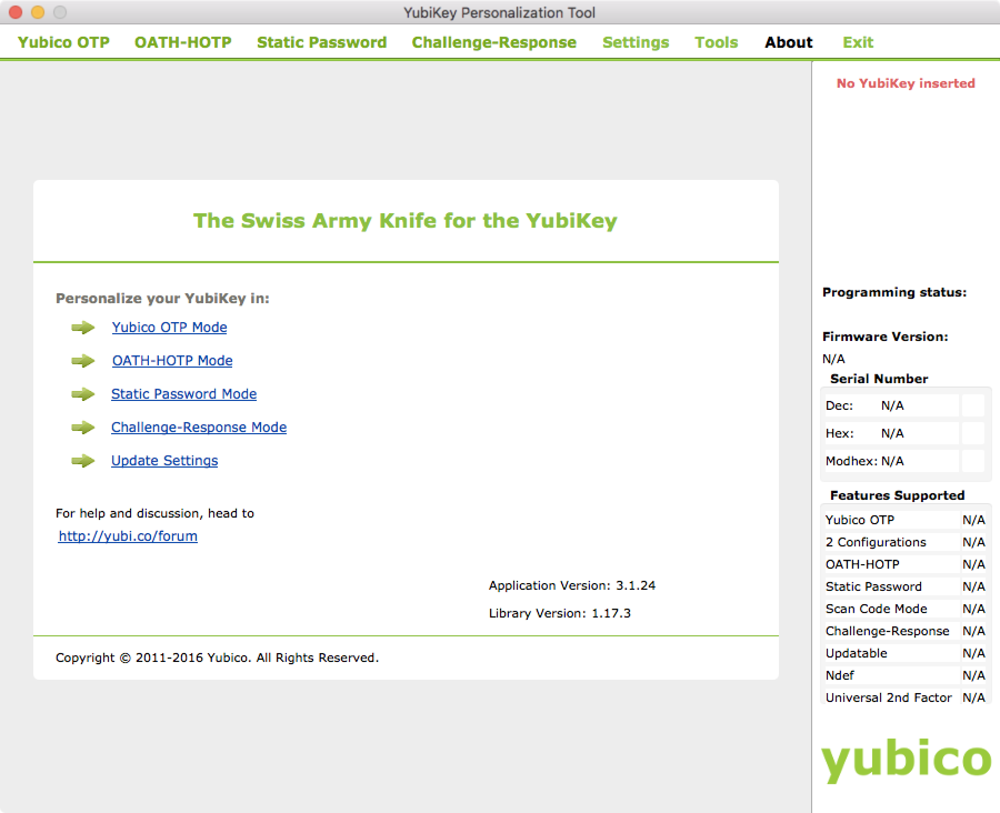
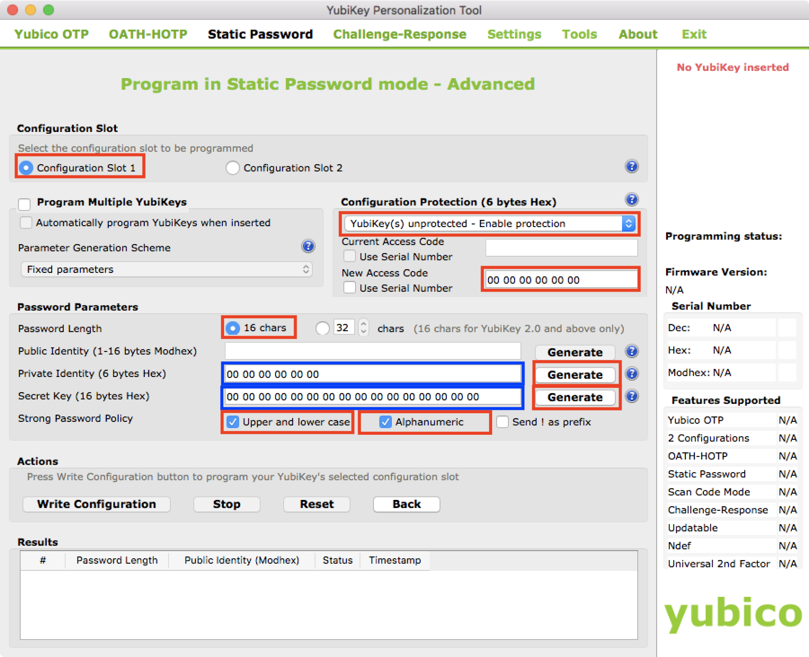
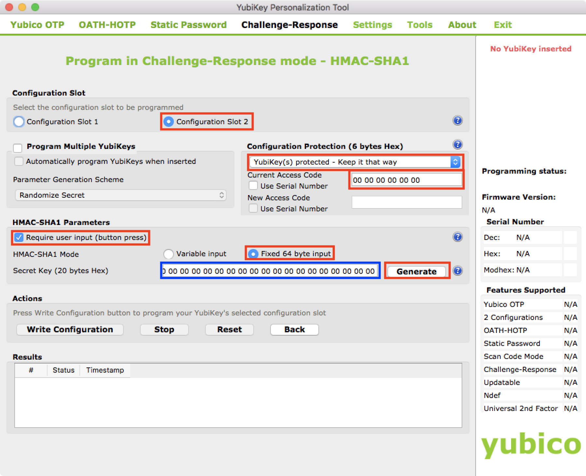
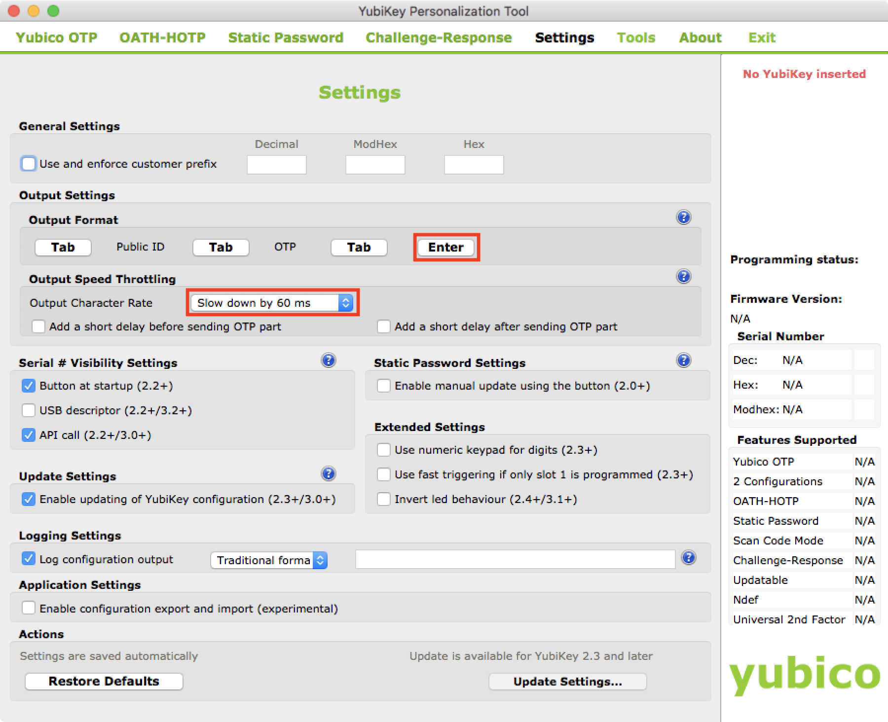
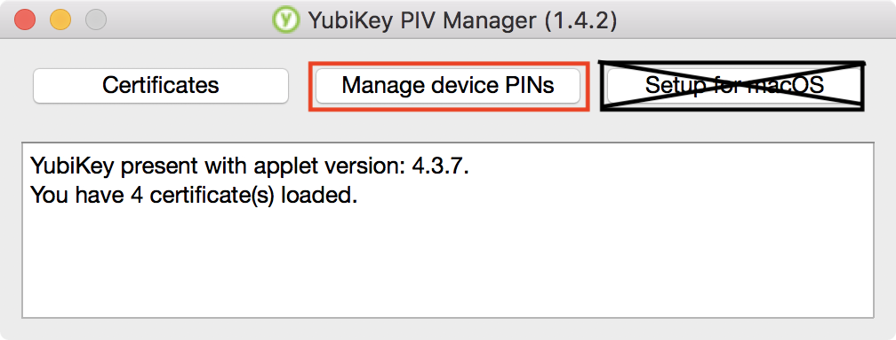
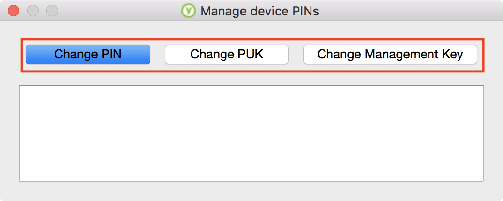

Hardware
=========

The unibody design of the macbook pro makes tamper proofing much easier than more user serviceable cases. With a few creative tricks and some config changes, the system can easily be hardened against tampering.

Tamper evident 
--------------

The easiest method for tamper proofing a macbook pro is to paint over one or two of the case screws on the underside of the laptop using a coarse flake glitter nail polish. After the polish is dried take a close up squared photograph of the area, preferably with a ruler in view for size reference. Then use you PGP key to sign the images and store them on dropbox or elsewhere for later auditing.



To audit the seal, simply take a new photo with a ruler in frame and open the before and after images in a photo editing software and spot check between features. You can also orient and line up the images in layers to perform a ["blink test"](https://en.wikipedia.org/wiki/Blink_comparator).

?> For added security you can mark the first coat with UV ink and apply a second clear-coat to seal it. Then use a uv-penlight for quick spot-checks on the go.



---

Firmware
---------

At this point any firmware updates that were bundled with OS updates should have been applied. Lets double check and verify everything is ok, as [some EFI updates fail to be applied](https://duo.com/blog/the-apple-of-your-efi-mac-firmware-security-research), then lock down the firmware.

!> Password protecting the firmware is a critical mitigation at this point, so future packages can't easily modify the system without authentication.


### Check EFI ###

`❯ cd /usr/libexec/firmwarecheckers/`  
`❯ eficheck/eficheck --integrity-check`

```stdout
EFI Version: MBP143.88Z.0167.B00.1708080129
Primary allowlist version match found. No changes detected in primary hashes.
```

### Check ethernet ###

`❯ sudo ethcheck/ethcheck --integrity-check`

```stdout
Could not find any BCM5701Enet devices or device driver is not supported
```

### Payload validation ###

Further EFI checks can be conducted using the [`efivalidate`](https://github.com/dropbox/efivalidate) tool to confirm firmware authorship

### Firmware password ###

> Setting a firmware password prevents your Mac from starting up from any device other than your startup disk. It may also be set to be required on each boot.

> This feature [can be helpful if your laptop is lost or stolen](https://www.ftc.gov/news-events/blogs/techftc/2015/08/virtues-strong-enduser-device-controls), protects against Direct Memory Access (DMA) attacks which can read your FileVault passwords and inject kernel modules such as [pcileech](https://github.com/ufrisk/pcileech), as the only way to reset the firmware password is through an Apple Store, or by using an [SPI programmer](https://reverse.put.as/2016/06/25/apple-efi-firmware-passwords-and-the-scbo-myth/), such as [Bus Pirate](http://ho.ax/posts/2012/06/unbricking-a-macbook/) or other flash IC programmer.

Check firmware password

`❯ sudo firmwarepasswd -check`

```stdout
Password Enabled: Yes
```

Set firmware password

`❯ sudo firmwarepasswd -setpasswd -setmode command`

```stdout
Setting Firmware Password
Enter password:
```

---

Standby, Sleep, & Hibernate
---------------------------

To take full advantage of FileVault, we'll need to configure the system power settings to evict our key on standby. Evicting the FileVault key ensures the drive is protected by its encryption scheme, if left unattended.

### Energy settings ###

?> The following configuration allows the system to sleep the display and drives after a specified idle time, prompting the user for a password or touchID on wake to re-enter the session. If the lid is closed the system will hibernate after 60 seconds, evicting the FV-key; when the user wakes the system they'll be prompted for the disk password, then greeted with the user login screen, which may or may not allow touchID depending on how much time has passed in hibernation.

```bash
❯ sudo pmset -a destroyfvkeyonstandby      1
❯ sudo pmset -a standbydelay         0
❯ sudo pmset -a standby              1
❯ sudo pmset -a powernap             0
❯ sudo pmset -a disksleep            10
❯ sudo pmset -a sleep                0
❯ sudo pmset -a autopoweroffdelay    0
❯ sudo pmset -a hibernatemode        3
❯ sudo pmset -a autopoweroff         1
❯ sudo pmset -a displaysleep         2
❯ sudo pmset -a tcpkeepalive         1
❯ sudo pmset -a lidwake              1
```

### Quick Sleep ###

In addition to the lid close event, which triggers FVkey eviction in 60 seconds, we can add other quick actions to put the system in a locked state.

Adding a sleep option to the touch bar is one. From **System Preferences**, **Keyboard**, **Customize Control Strip**, drag the "lock" and "sleep" buttons to the touch bar.




Next, set one of the hotcorners to immediately put the display to sleep, requiring user auth on wake.

Set hot-corner:

`❯ sudo defaults write com.apple.dock wvous-tl-corner -int 10`  
`❯ sudo defaults write com.apple.dock wvous-tl-modifier -int 0`  

Go to, **System Preferences**, **Security & Privacy**, **General**, and set the option to "Require password 'immediately' after sleep or screen saver begins"

`❯ sudo defaults write com.apple.screensaver askForPassword -int 1`  
`❯ sudo defaults write com.apple.screensaver askForPasswordDelay -int 0`


  
---

YubiKey
--------

This guide will assume we are working with a **YubiKey 4** or **Yubikey Neo** -- _one that supports PGP key slots._

> The YubiKey is a hardware authentication device manufactured by Yubico that supports one-time passwords, public key encryption and authentication, and the Universal 2nd Factor (U2F) protocol developed by the FIDO Alliance (FIDO U2F). It allows users to securely log into their accounts by emitting one-time passwords or using a FIDO-based public/private key pair generated by the device. YubiKey also allows for storing static passwords for use at sites that do not support one-time passwords.

> The Yubikey also implements the HMAC-based One-time Password Algorithm (HOTP) and the Time-based One-time Password Algorithm (TOTP), and identifies itself as a keyboard that delivers the one-time password over the USB HID protocol.

These feature will be critical in mitigating risks defined in out threat model, such as over the shoulder skimming, and create very robust authentication strategy.


### Drivers & Apps ###

Install the following command line tools via `brew install <package name>`

- ykman
- ykpers
- libyubikey
- pinentry-mac
- pam_yubico
- yubico-piv-tool    

Then install the drivers and GUI applications via `brew cask install <package name>`

- yubico-authenticator
- yubico-yubikey-manager
- yubico-yubikey-piv-manager
- yubico-yubikey-personalization-gui

---

### Configuration ###

Our primary use-case is for offline Multi Factor Authentication (MFA) without running a local OTP service -- in case our macbook doesn't have network access. For cloud services we'll assume FIDO U2F compatibility.

The Yubikey is also capable of PIV log on for macOS 10.12+, however, we won't be using the feature due to its single factor nature. Instead we'll want to configure the yubikey's PIV slots with our GPG keys and X.509 certs, slot#1 with a static token, slot#2 for HMAC challenge-response, and enroll its FIDO U2F & OTP functionality as needed.

`❯ open /Applications/YubiKey\ Personalization\ Tool.app`




#### Slot 1 - Static Token####

Select the "Static Password" config pane, and open "Advanced" mode.



* [ ] Ensure **`Slot 1`** is selected. 
* [ ] **`Enable protection`** for the key, **do not** use the card serial number. Store the access code in your keychain.
* [ ] Set the password length to **`16 chars`**. We dont use 32 chars to avoid creating a public identity segment.
* [ ] **Check** "Upper and lower case" and "Alphanumeric".
* [ ] Click to generate a **"Private Identity"**. Save a copy in your keychain.
* [ ] Click to generate a **"Secret Key"**. Save a copy in your keychain.

Write the configuration


#### Slot 2 - Challenge-Response HMAC SHA1 ####

Select the "Challenge-Response" config pane, and open the "HMAC-SHA1" mode.



* [ ] Ensure **`Slot 2`** is selected. 
* [ ] Set **`YubiKey(s) protected - Keep it that way`**, and provide the current code (saved in your keychain)
* [ ] **Check** "Require user input".
* [ ] **Check** "Fixed 64 byte input". _We this for Keepass compatibility, later_
* [ ] Click to generate a **"Secret Key"**. Save a copy in your keychain.

Write the configuration


#### Settings ####

Select the "Settings" config pane.



* [ ] Ensure "Enter" is **`inactive`** -- it shouldn't be sent at the end of an input.
* [ ] Set "Output character rate" to  **`Slow down by 60ms`**, to comply with input rate-limiting.

Update Settings.


### Set the PIV PIN codes ###

Use the YubiKey PIV Manager to setup the PIN, PUK, and "Management key". For typical usage, you will want to memorize the PIN, and keep a copy of the PUK and Management keys in a secure location (keychain). 

Open the PIV manager tool, it should detect a new yubikey and prompt for setup.

`❯ open /Applications/YubiKey\ PIV\ Manager.app`

> The YubiKey PIV Manager presents you with an option to only set the PIN and not set a PUK or Management Key. **Note that this scheme is NOT compatible with other tools.** Do not select this option. Ensure the PIN, PUK, and Management key are all set -- see [docs](https://developers.yubico.com/PIV/Guides/Device_setup.html) for full details.



> The default PIN code is **`123456`** and **`12345678`** for the Admin PIN (aka PUK). The Reset Code (Management Key) can be up to 127 ASCII characters long.

Set your PIV codes & key, _Saving a copies to your keychain_

* [ ] PIN
* [ ] PUK
* [ ] Management Key




