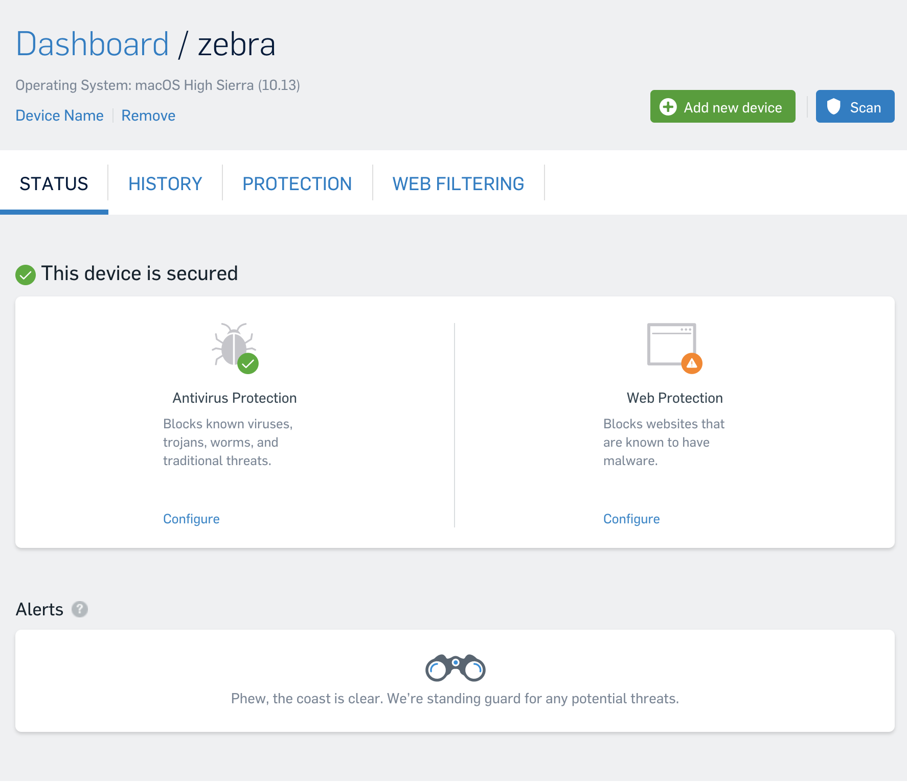

Intrusion detection
====================

Aside from patching holes, hardening configuration, and implementing best practices we can apply some proactive measures to ensure rapid threat identification. 

However, its important to note:

> Anti-virus programs are a double-edged sword -- not useful for advanced users and will likely increase attack surface against sophisticated threats, however possibly useful for catching "garden variety" malware on novice users' Macs. There is also the additional processing overhead to consider.

Regardless, we'll utilize the free [Sophos Home](https://home.sophos.com/) anti-malware suite to cover threats present in our day-to-day web activities that may slip through even the most diligent security practices. Additionally, we'll add a number of tools designed to help identify advanced threats.


Anti-malware
--------------

Sophos provides a free a robust anti-malware solution thats updated frequently, and both free and low-weight on system resources. [Sophos Home](https://home.sophos.com/) is downloaded directly from the vendor and installed as an endpoint client, its management is done largely though a cloud dashboard.

!> Unfortunately macOS continues to top the list of software with the most [critical vulnerability](https://www.cvedetails.com/product/156/Apple-Mac-Os-X.html?vendor_id=49), creating a constantly changing attack surface for existing malware



---

System Integrity Protection
----------------------------

Ensure Apple's SIP is enabled,  `❯ csrutil status`

```stdout
System Integrity Protection status: enabled.
```

If not, reboot into recovery mode:

1. Restart.
2. Hold down CMD + R during reboot to enter Recovery Mode.
3. Click on the Utilities Menu.
4. Launch Terminal.
5. Type in `❯ csrutil enable`
6. Restart.

---

Objective-See tools
---------------------

This collection of tools was developed by security researcher [Patrick Wardle](https://objective-see.com/index.html), and offers a great addition to our threat mitigation strategy. Many of Patrick Wardle's tools are integrate [VirusTotal](https://www.virustotal.com/#/home/upload) for updated threat signatures.

Each of these tools can be installed via `❯ brew cask install <package_name>`

- [ ] **knockknock**  
    _Description_  
    "KnockKnock... Who's There?" See what's persistently installed on your Mac. KnockKnock uncovers persistently installed software in order to generically reveal malware. _[learn more](https://objective-see.com/products/knockknock.html)_
- [ ] **taskexplorer**  
    _Description_
    TaskExplorer allows one to visually explore all running tasks (processes). Quickly see a task's signature status, loaded dylibs, open files, network connection, and much more. [learn more](https://objective-see.com/products/taskexplorer.html) 
- [ ] **blockblock**  
    _Description_  
    BlockBlock provides continual protection by monitoring persistence locations. Any new persistent component will trigger a BlockBlock alert, allowing malicious items be blocked. [learn more](https://objective-see.com/products/blockblock.html)
- [ ] **kextviewr**  
    _Description_
    KextViewr displays all loaded kexts, along with their signing status, full path, VirusTotal detection ratios, and more. [learn more](https://objective-see.com/products/kextviewr.html)
- [ ] **dhs**  
    _Description_
    Dylib hijack scanner or DHS, will scan your computer for applications that are either susceptible to dylib hijacking or have been hijacked. [learn more](https://objective-see.com/products/dhs.html)

---

Executable whitelisting/blacklisting
------------------------------------

### Gatekeeper ###

macOS has a builtin system for allowing/blocking application from executing, and does so based on its code signature; unsigned applications will raise a notice and be disallowed unless explicitly allowed.

Gatekeeper's Quarantine also keeps track of downloaded files, which can be viewed by querying the sqlite database:

`❯ sqlite3 /Users/$USER/Library/Preferences/com.apple.LaunchServices.QuarantineEventsV2`

```sql
SELECT 
    datetime(LSQuarantineTimeStamp + 978307200, "unixepoch") as LSQuarantineTimeStamp,
    LSQuarantineAgentName, 
    LSQuarantineOriginURLString, 
    LSQuarantineDataURLString 
FROM LSQuarantineEvent
``` 


### Santa ###

> Santa is a binary whitelisting/blacklisting system for macOS. It consists of a kernel extension that monitors for executions, a userland daemon that makes execution decisions based on the contents of a SQLite database, a GUI agent that notifies the user in case of a block decision and a command-line utility for managing the system and synchronizing the database with a server.

!> **Santa is not yet a 1.0.**

<https://github.com/google/santa>

---

Automated Detection
--------------------

For advanced use-cases there's [OSSEC](https://ossec.github.io/downloads.html)

> It performs log analysis, integrity checking, rootkit detection, time-based alerting, and active response.


### Network ###

[Snort](https://www.snort.org/) is an advanced IDS, capable of actively identify threats and can be configured with various rule sets to take action on suspicious traffic events.

Install, `❯ brew install snort`

---

Monitoring  
------------

There a number of builtin tools for monitoring processes, file io, and network activity in macOS.

- View launch daemons, `❯ sudo launchctl list`  
- List running processes, `❯ ps -ef`
- View processes resource usage, `❯ open /Applications/Utilities/Activity\ Monitor.app`
- List open network files, `❯ sudo lsof -Pni`
- View network activity, `❯ sudo netstat -atln`
- Watch system logs, `❯ open /Applications/Utilities/Console.app`


### Network traffic ###

[Wireshark](https://www.wireshark.org/), can be used to analyze and reconstruct network traffic to help identify unauthorized communications. 

Install, `❯ brew install caskroom/cask/wireshark`

?> If you're new to wireshark, checkout this [<i class="fab fa-youtube fa-lg"></i> intro to the GUI](https://www.youtube.com/watch?list=PLnKJHZhW_BuCPcIg6Ja2boDeHIRwoHMT-&v=U0QABcTD-xc) and logging environment.


