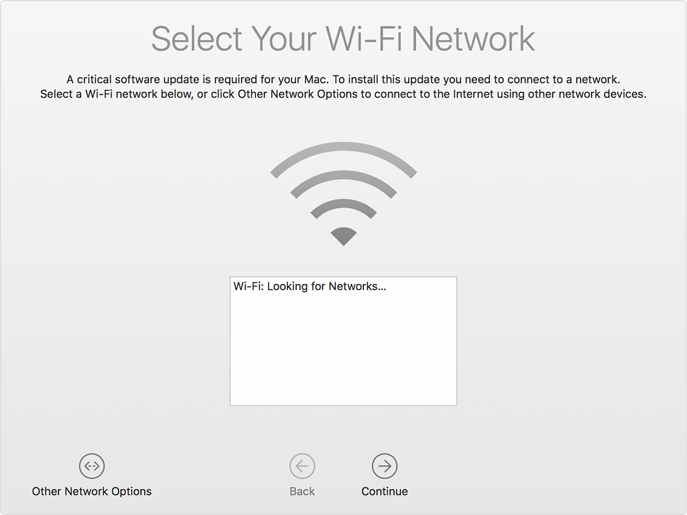
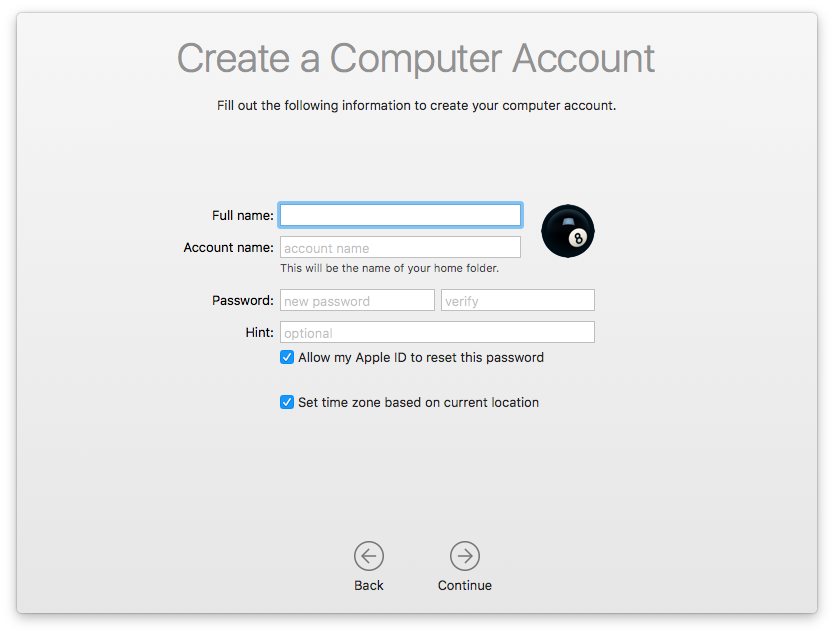
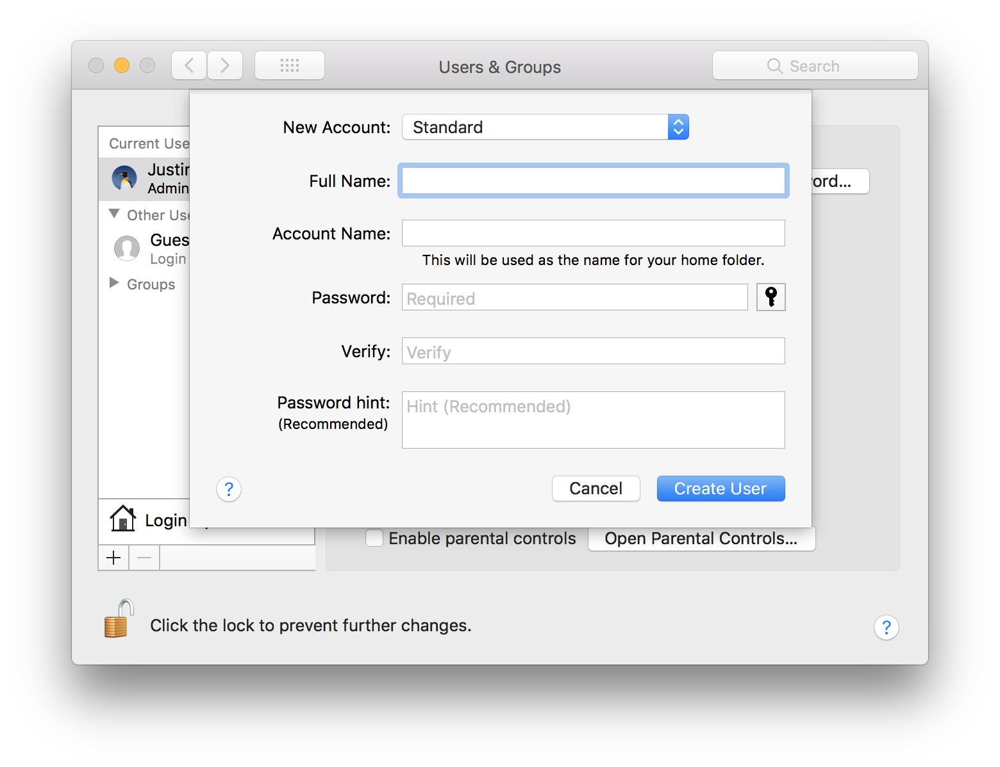
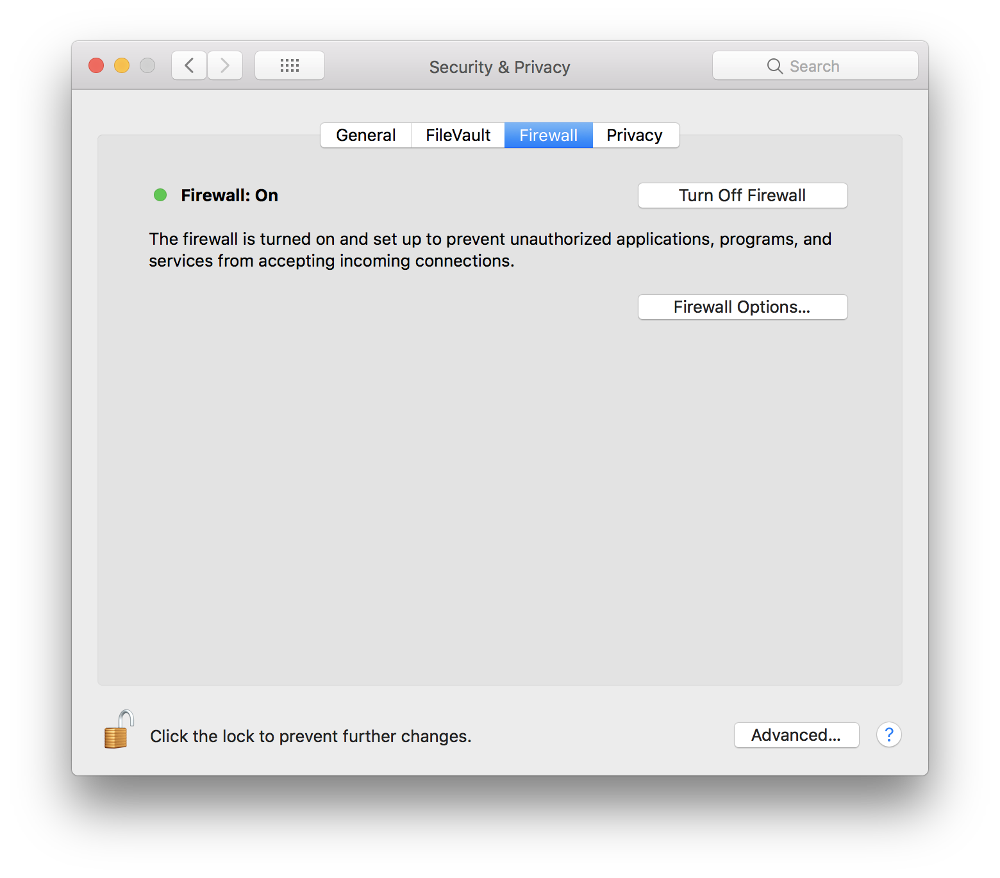
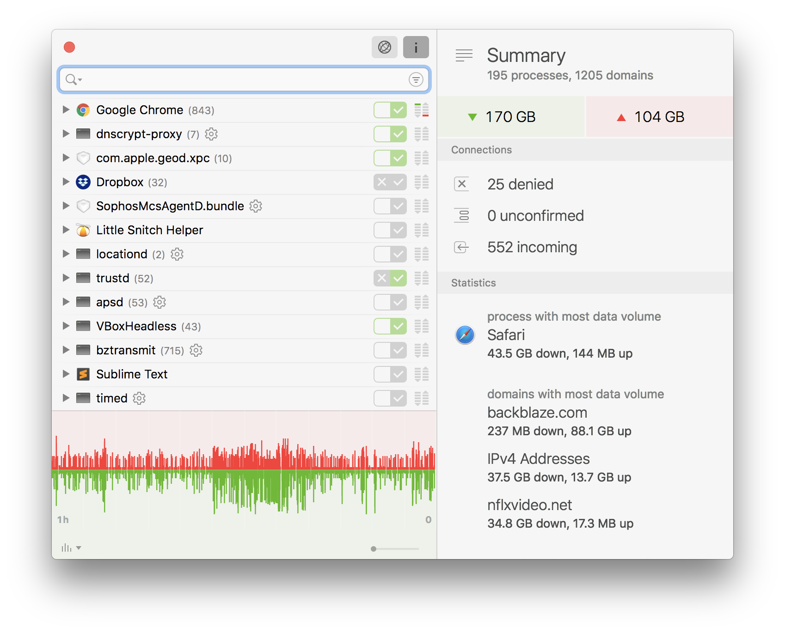
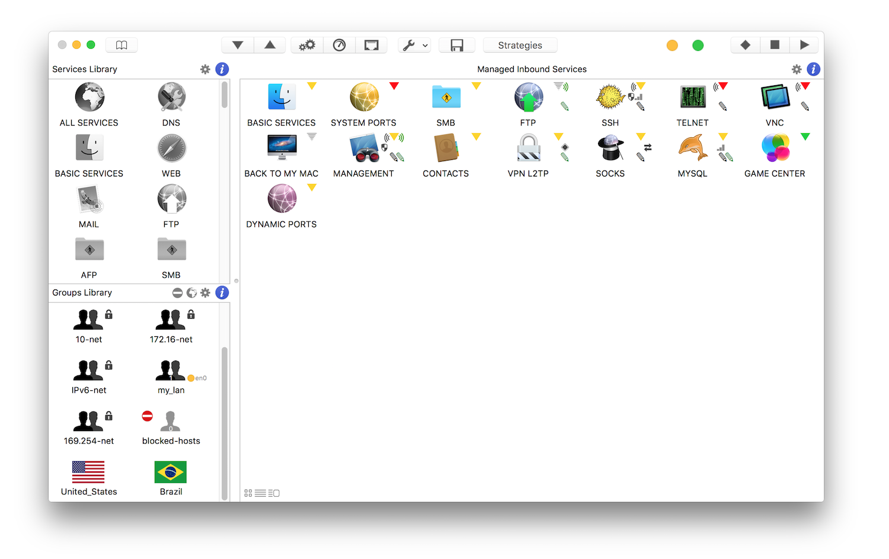
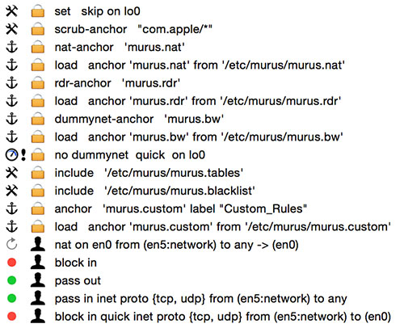

Installing macOS
=================

While installing macOS skip any propmts to configure networking and/or expose 
serivce outside the localhost. Netwrokign and other serivces should be setup 
after configuring the firewall.


Full Disk Encryption
--------------------

After booting up from the installation media prepared in the last step youll be 
prompted to install the operating system. Before proceeding we want to format the 
system drive for whole disk encryption. We'll use the encrypted version of APFS
or HFS+ depending on your distribution.

1. Close the OS install propmt window

2. Click "Utlities" in the menu bar

3. Select "Disk Utility" from the menu


4. Select the system drive from the left hand menu, click erase.

5. Select an **Encrypted** variant of the options in the **Format** dropdown.


    The following prompt will ask for a password and hint. Use the **Level III** passphrase you chose earlier when defining the threat model, skipping the hint. The phrase input should be:

    `"optional user pepper" + "yubikey static token" + "Level III phrase"`

    This pass phras will only be used during a cold start, your used pepper should something easy to remember and unique per device.

    > **Scenario:** *Cold start login*  
    FileVault prompts for passcode. User enters *optional pepper*, presses yubikey and enters *static token*, then enters *Level III* pass phrase.

6. Once the system drive has been formatted, exit Disk Utility and proceed with the 
OS Installer.


New mac setup
--------------

Proceed through the new mac setup, skipping all steps -- we want to defer network
and other setup until after the firewall is in place.

!> Try to avoid selecting a wireless network, if unavoidable (due to newer activation
requirements) connect to a secure local/dummy wifi SSID.



When prompted to create your account, use your **Level I** password, without a hint.

!> Uncheck, "Allow my Apple ID to reset this password"



!> Moreover, when prompted regarding FilVault recovery and/or login opt to create recovery keys instead of an iCloud reset, and **Do Not** allow any users to "unlock the disk". This will be important later on when we setup Yubikey MFA.

Finish Apple's guided setup.


First boot
----------

On first boot, confirm the Apple installer has finished, then restart to [clear the NVRAM](https://support.apple.com/en-us/HT204063).

1. Restart
2. On boot press and hold `⌥ Option` + `⌘ Command` + `P` + `R`, for ~20 seconds
3. After booting set your machine name as desired

    `❯ sudo scutil --set ComputerName your_computer_name`  
    `❯ sudo scutil --set LocalHostName your_hostname`  


User accounts
-------------

You should have already created an `admin` user account during Apple's guided installation. Ideally, the admin account should be left to tasks that require privilege escalation; such as changing system configuration, installing software to `/Applications`, or managing users. Both [Apple](https://help.apple.com/machelp/mac/10.12/index.html#/mh11389) and [NIST CSRC](http://csrc.nist.gov/publications/drafts/800-179/sp800_179_draft.pdf) recommend using a standard account for day-to-day use. This suggestion is an attempt to mitigate the [many vectors opened up](https://bogner.sh/2014/03/another-mac-os-x-sudo-password-bypass/) by `sudo` group privileges.

**Notice.** A `standard` account may cause problems for developers as they don't have access to `sudo`. Still, the use of a standard user account or sandbox VM/Container for non-admin work is recommended to keep application from gaining root access.

For good measure create a standard user account for your day-to-day activities using the `Users & Groups` pane in `System Preferences`, clicking the `+` just below "Login Options".




Firewall
---------

After finishing Apple's guided installation you'll want to setup a firewall.


### Socket filtering ###

macOS ships with a built-in firewall that blocks all incoming connections. The built-in firewall can be activated by going to **System Preferences**, **Security & Privacy**, and **Firewall**.



Enable the firewall:  
`❯ sudo /usr/libexec/ApplicationFirewall/socketfilterfw --setglobalstate on`

Enable logging:  
`❯ sudo /usr/libexec/ApplicationFirewall/socketfilterfw --setloggingmode on`

Enable stealth mode:  
`❯ sudo /usr/libexec/ApplicationFirewall/socketfilterfw --setstealthmode on`


Set whether built-in signed applications are to automatically receive incoming connections or not.  
`❯ sudo /usr/libexec/ApplicationFirewall/socketfilterfw --setallowsigned off`

Set whether downloaded signed applications are to automatically receive incoming connections or not.  
`❯ sudo /usr/libexec/ApplicationFirewall/socketfilterfw --setallowsignedapp off`


### Application firewall ###

Additionally, third party firewalls such as [Little Snitch](https://www.obdev.at/products/littlesnitch/index.html) provide an extra layer of protection. Firewalls like this use a [kernel extension](https://developer.apple.com/library/mac/documentation/Darwin/Conceptual/KernelProgramming/Extend/Extend.html) to filter both incoming and outgoing traffic



Its important to note that these types of application firewalls can still be bypassed via root level escalations or [OS vulnerabilities](https://www.blackhat.com/docs/us-15/materials/us-15-Wardle-Writing-Bad-A-Malware-For-OS-X.pdf). There are also [engineered attacks](https://reverse.put.as/2016/07/22/shut-up-snitch-reverse-engineering-and-exploiting-a-critical-little-snitch-vulnerability/) specifically targeting software firewalls, so be sure to keep your software patched and up to date.


### Packet filtering ###

macOS also has a sophisticated packet level firewall built-in; [PacketFilter](https://developer.apple.com/legacy/library/documentation/Darwin/Reference/ManPages/man8/pfctl.8.html).

The easiest way to configure and manage `pf` is via a GUI tool like [IceFloor](http://www.hanynet.com/icefloor/) or [Murus](http://www.murusfirewall.com/).

#### Murus ####

Murus is preferred for its ease of use, and in most cases the free version is more than enough for protecting a system from inbound scans. Its manager makes navigating complex rule sets much easier.





#### General PFCTL Commands ####

Even with Murus installed we can still use command line tools, `pfctl`, etc..

```bash
pfctl -d   # disable packet-filtering
pfctl -e   # enable packet-filtering
pfctl -q   # run quiet
pfctl -vv  # run even more verbose
```


##### Setup a blocklist #####


Create a rule set

`❯ vim pf.rules`

And paste-in the following, where `en0` is your WAN facing adapter.

```
set block-policy drop
set fingerprints "/etc/pf.os"
set ruleset-optimization basic
set skip on lo0
scrub in all no-df
table <blocklist> persist
block in log
block in log quick from no-route to any
pass out proto tcp from any to any keep state
pass out proto udp from any to any keep state
pass out proto icmp from any to any keep state
block log on en0 from {<blocklist>} to any
block log on en0 from any to {<blocklist>}
```

Enable packet filter

`❯ sudo pfctl -e -f pf.rules`

##### Example #####

Try blocking Facebook:

1. Query [Merit RADb](http://www.radb.net/) for the list of networks in use by a site like [Facebook](https://ipinfo.io/AS32934)

    `❯ whois -h whois.radb.net '!gAS32934'`

2. Add the list of networks returned to the pf blocklist:

    `❯ sudo pfctl -t blocklist -T add 31.13.24.0/21 31.13.64.0/24 157.240.0.0/16`

3. Confirm the addresses were added:

    `❯ sudo pfctl -t blocklist -T show`

    ```stddout
    No ALTQ support in kernel
    ALTQ related functions disabled
       31.13.24.0/21
       31.13.64.0/24
       157.240.0.0/16
    ```

4. Create an interface for logging

    `❯ sudo ifconfig pflog0 create`

5. Confirm traffic is blocked to those addresses

    `❯ dig a +short facebook.com`

    ```stdout
    157.240.2.35
    ```

    **Notice:** DNS queries still pass-through

    `❯ curl --connect-timeout 5 -I http://facebook.com/`

    ```stdout
    * Trying 157.240.2.35...
    * TCP_NODELAY set
    * Connection timed out after 5002 milliseconds
    * Closing connection 0
    curl: (28) Connection timed out after 5002 milliseconds
    ```

    `❯ sudo tcpdump -tqni pflog0 'host 157.240.2.35'`

    ```stdout
    IP 192.168.1.1.62771 > 157.240.2.35.80: tcp 0
    IP 192.168.1.1.62771 > 157.240.2.35.80: tcp 0
    IP 192.168.1.1.62771 > 157.240.2.35.80: tcp 0
    IP 192.168.1.1.62771 > 157.240.2.35.80: tcp 0
    IP 192.168.1.1.162771 > 157.240.2.35.80: tcp 0
    ```


Software Updates
-----------------

After installing a verified copy of macOS and configuring the firewall, we should update the OS and system packages. Later we'll install `mas` and `homebrew` to assist with package management.


### macOS ###

List updates available via the Apple App Store

`❯ softwareupdate --list`

Install recommended updates only

`❯ sudo softwareupdate --install --recommended --verbose`

Install all available updates

`❯ sudo softwareupdate --install --all --verbose`


### Homebrew ###

Homebrew is package manager for macOS that makes it easier to install and update common software distributions.

Install homebrew, this will also install `xcode-select` command line tools

`❯ /usr/bin/ruby -e "$(curl -fsSL https://raw.githubusercontent.com/Homebrew/install/master/install)"`

> Remember to periodically run brew update and brew upgrade on trusted and secure networks to download and install software updates. To get information on a package before installation, run brew info <package> and check its recipe online.


### Mas ###

With `mas` keeping track of software updates from the app store should be as easy as running `mas outdated`

> `mas` is a simple command line interface for the Mac App Store. Designed for scripting and automation.

Install mas via homebrew

`❯ brew install mas`

Check for outdated apps

`❯ mas outdated`

```stdout
497799835 Xcode (7.0)
446107677 Screens VNC - Access Your Computer From Anywhere (3.6.7)
```

### Package inventory ###

Keeping track of all installed packages is much easier with [`brew bundle`](https://github.com/Homebrew/homebrew-bundle). The automatically generated manifest can also be used to bootstrap new installations with all your needed software.

`❯ brew bundle dump`

```stdout
cask_args appdir: "/Applications"
tap "caskroom/cask"
tap "telemachus/brew", "https://telemachus@bitbucket.org/telemachus/brew.git"
brew "imagemagick"
brew "mysql@5.6", restart_service: true, link: true, conflicts_with: ["mysql"]
brew "emacs", args: ["with-cocoa", "with-gnutls"]
cask "google-chrome"
cask "java" unless system "/usr/libexec/java_home --failfast"
cask "firefox", args: { appdir: "~/my-apps/Applications" }
mas "1Password", id: 443987910
```


[Next](pages/hardware.md)

