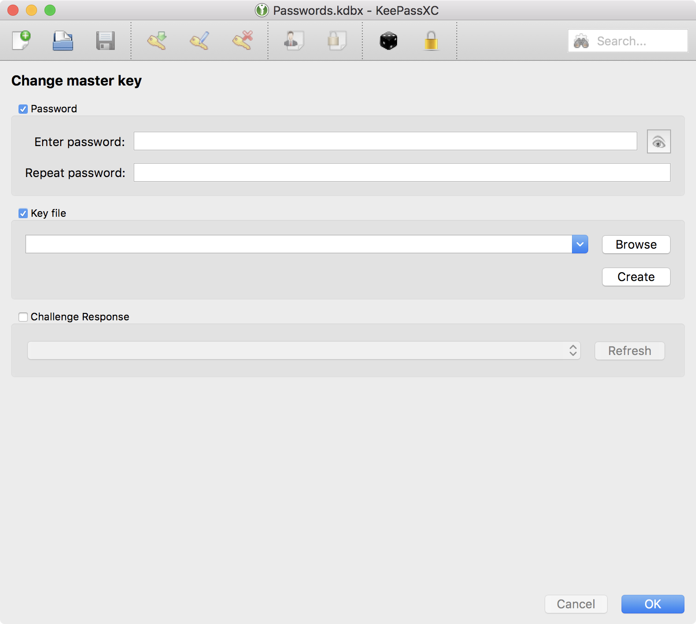
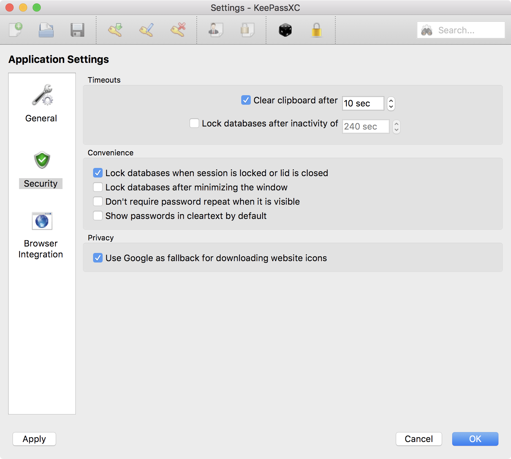
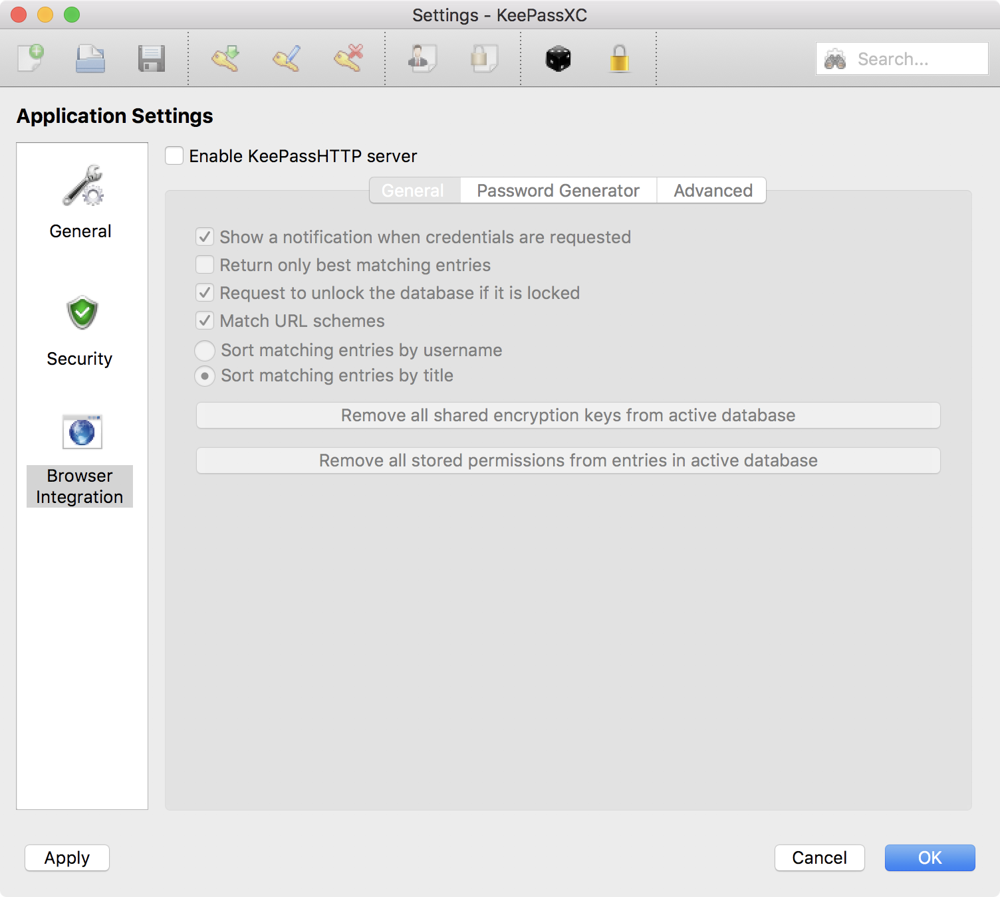
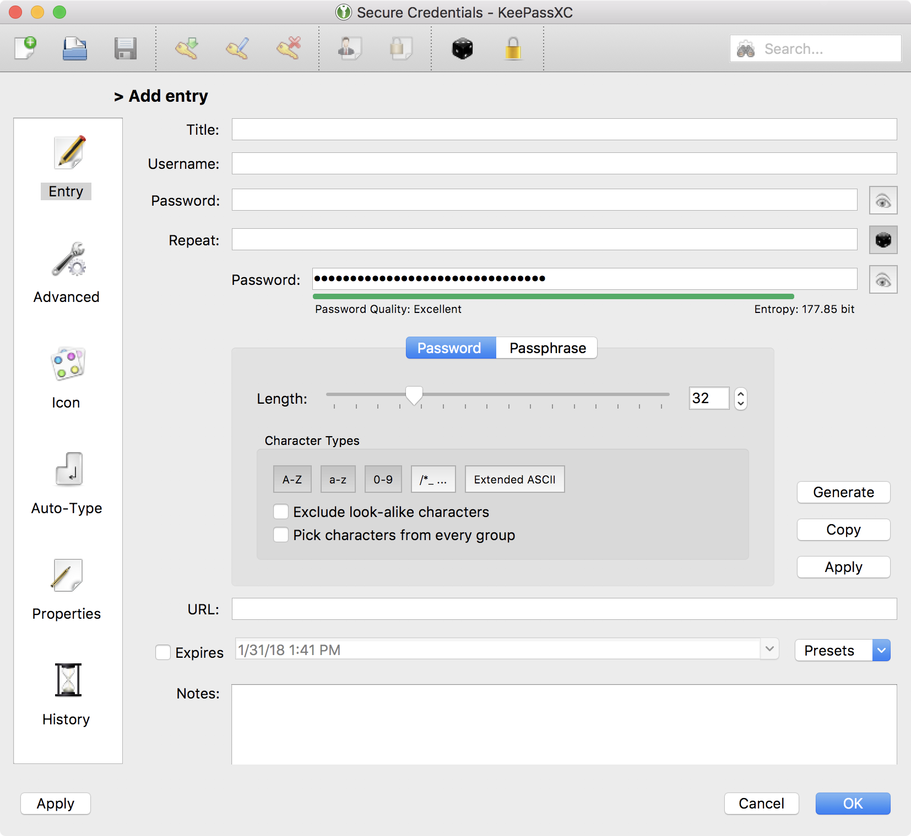
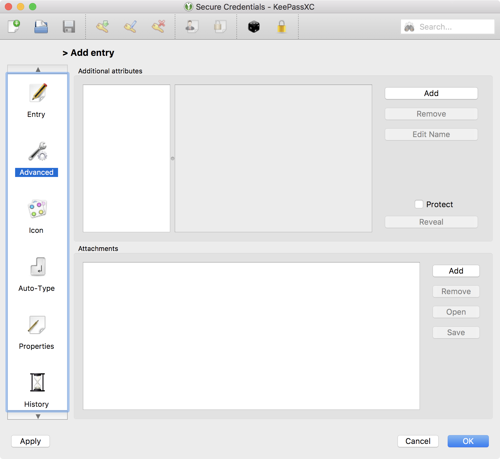
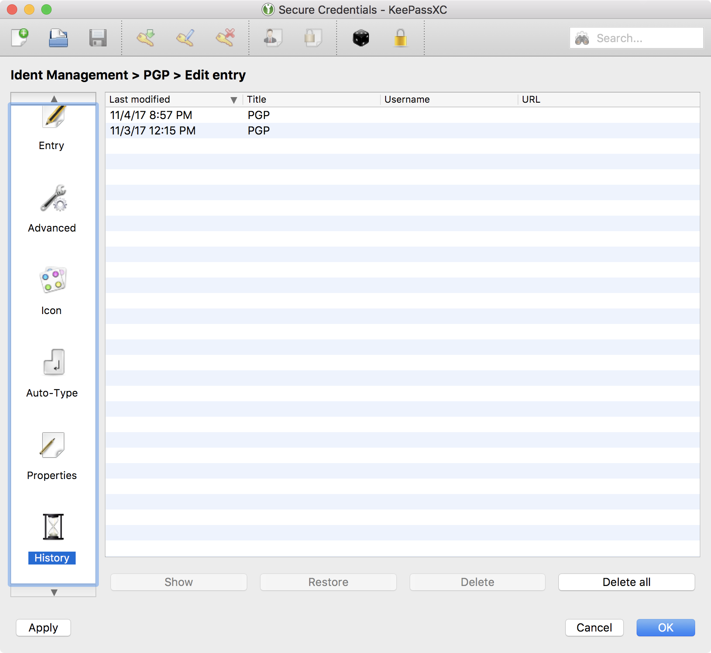

Keychain
=========

Proper management of credentials is the cornerstone of a secure system. For this reason we'll migrate away from macOS's builtin keychain for all but trivial logins. There are many password management solutions available, most of them cloud offerings; however, this guide aims to keep critical assets under our control to as much extent as possible.

We'll be using the open source [KeePassXC](https://keepassxc.org/) client to manage our passwords, syncing them via Dropbox.

Setup
------

Install KeePassXC, `❯ brew install caskroom/cask/keepassxc`

Create a new database using your **Level II** passphrase and one of the previously **generated keyfiles**.

?> For convenience we can store the database in our dropbox folder, and later develop a "burn protocol" for the worst-case scenario of a compromise.

Configure
---------

Ensure the clipboard is erased after a reasonable amount of time, **`10 seconds`**, when copying secrets from the keychain. Also make sure the keychain is secured when the user sessions is locked.

Though keepass has a HTTP server for use with its browser plugins, we'll keep this **`disabled`**; instead copying secrets as needed. This reduces the chance of any http-server based attack vectors.

Passwords
----------

!> Best practice is to use a unique high-entropy password for each new login. Typically 32 or 64 characters in length, as maximally allowed by each service.

?> Remember to save all future credentials in your keepass database.

Attributes & Attachments
------------------------

KeePassXC also supports storage of additional attributes and files. This is useful for keeping copies of your keyfiles, GPG keys, and other important secrets. 

?> <i class="fas fa-lock"></i>**+ Security tip:**  
Often times a service will allow you to recover a login via a series of Question and Answer prompts. In these cases its best to generate short random strings or phrases and save the answers as Keepass attributes.  
_For example:_ "What is your mothers maiden name?", "WAJ5loMG3lLsfV"  
_Or if allowed_, a phrase might work better, and be easier to use during over-the-phone challenges  
_i.e_ "Whats your favorite book", "urban backpack unicorn".  
These are more secure than a commonly know truth like "Smith" and robust against social engineering attacks.

Audit Log
---------

KeePassXC maintains a log of updates made to each entry, this is useful for enforcing password hygiene, or to cross-reference against other logs.

Burn Protocol
--------------

If a device with a keepass database is compromised.

1. Move the current kpdb to a secure usb
2. Permanently delete the dropbox copy, including versions and trash.
3. Unlink the device from Dropbox
4. Issue a device remote wipe
5. Change the keyfile used in the composite
6. Update kpdb's encryption
7. Copy new kpdb to Dropbox
