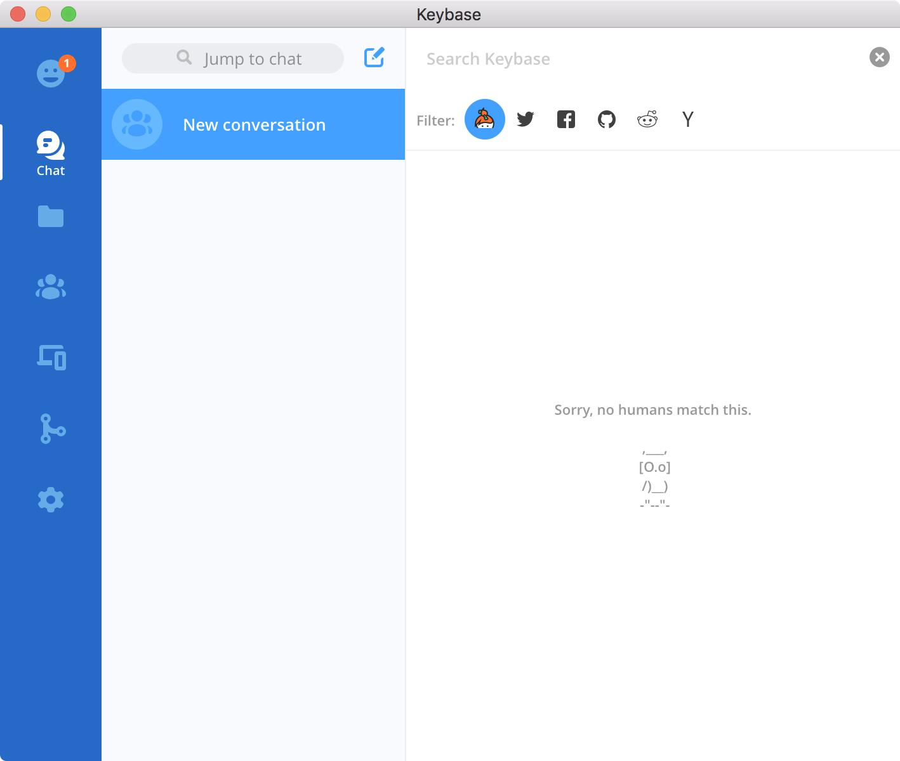

Privacy and Anonymity
======================

Despite optimizing system configuration for security, information may still be leaking outside trust boundaries through other channels. In particular, search histories and web traffic. This section will attempt to mitigate those threats through `pf` firewall rules, filters, and adaptive measures.


Spotlight search
-----------------

> Disable Spotlight Suggestions in both the Spotlight preferences and Safari's Search preferences to avoid your search queries being sent to Apple.


---

Homebrew
---------

Disable homebrew's analytics reporting if you'd like.

`❯ brew analytics off`

`❯ brew analytics`

```stdout
Analytics is disabled.
```

---

DNSCrypt
----------

The DNS protocol has a number of vulnerabilities that pose [serious risks](https://en.wikipedia.org/wiki/Domain_Name_System#Security_issues) to any networked system. Specifically we want to mitigate information leakage over the clear text protocol, enforce non-repudiation, and strong identification of lookups.

To do this we'll rely on a trusted list of Name servers implementing the [DNSsec](https://www.icann.org/resources/pages/dnssec-qaa-2014-01-29-en) protocol, and use encrypted communication with them via DNSCrypt. 

The tools needed to do this, `dnscrypt-proxy` and `dnsmasq` are bundled into a GUI pane available via homebrew.

Install the GUI Preferences pane

`❯ brew cask install dnscrypt`


---

Captive portal
----------------

Many wifi hotspots use captive portal to redirect new connection to their landing pages, however, this convenience is not without its risks.

> An attacker could trigger the utility and direct a Mac to a site with malware without user interaction, so it's best to disable this feature and log in to captive portals using your regular Web browser, provided you have first disable any custom dns and/or proxy settings.

`❯ sudo defaults write /Library/Preferences/SystemConfiguration/com.apple.captive.control Active -bool false`

---

Web browsers
-------------

> The Web browser poses the largest security and privacy risk, as its fundamental job is to download and execute untrusted code from the Internet. This is an important statement. The unique use case of Web Browsers of operation in hostile environments, has forced them to adopt certain impressive security features. The cornerstone of Web Browser security is the Same Origin Policy (SOP). In a few words, SOP prevents a malicious script on one page from obtaining access to sensitive data on another web page through that page's Document Object Model (DOM). If SOP is compromised, the security of the whole Web Browser is compromised.


Test your browsers traceability with the EFF's [Panopticlick](https://panopticlick.eff.org/) assessment.

!> Adobe Flash, Oracle Java, Adobe Reader, Microsoft Silverlight (Netflix now works with HTML5) and other plugins are security risks and should not be installed.

#### Ad blocking & Privacy Plugins ####

| Name | Safari | Chrome | Firefox |
|:---- |:------:|:------:|:-------:|
|uBlock Origin    | x | x | x |
|Ka-Block         | x |   |   | 
|Cert Patrol      |   |   | x |
|HTTPS Everywhere |   | x | x |
|Privacy badger   |   | x | x |


### Chrome ###

Practice good security hygiene and set `chrome://settings/` accordingly.

Send `Do not track` requests


Require user intervention to run flash:


Ensure you have the ability to view SSL cert information:

?> Goto `chrome://flags/#show-cert-link` in a chrome browser, and make sure the option is checked. *Note* this may not be an option in some versions and will not be enabled by default.

To view a cert click the padlock in the URL bar. This will trigger a dropdown; click the "Valid" link in the Certificate section. 


Additionally, you'll want to have the following extensions installed to further secure your browsing sessions.

* [uBlock Origin](https://github.com/gorhill/uBlock) to block trackers.
* [HTTPSEverywhere](https://www.eff.org/https-everywhere) to enforce valid ssl sessions.
* [Privacy badger](https://www.eff.org/privacybadger) to hide browser sessions and signatures.


### Firefox ###

To view an SSL cert click the padlock next to the url, then expand the arrow next to the cert. A new window should pop-up displaying the cert's details.


* [uBlock Origin](https://addons.mozilla.org/en-US/firefox/addon/ublock-origin/) to block trackers and ads.
* [HTTPSEverywhere](https://www.eff.org/https-everywhere) to enforce valid ssl sessions.
* [Privacy badger](https://www.eff.org/privacybadger) to hide browser sessions and signatures.
* [CertPartrol](http://patrol.psyced.org/) checks for changes to the certificate chain.


### Safari ###

To view an SSL cert click the padlock icon next to the url and click "show certificate"


Be sure to install these plugins:

* [uBlock Origin](https://github.com/el1t/uBlock-Safari/releases) to block trackers.
* [KaBlock](http://kablock.com/) to block ads & trackers.


### Tracking the trackers ###

To better understand how your information is being shared you can download and install [Lightbeam](https://www.mozilla.org/en-US/lightbeam/) for Firefox.

> Lightbeam is a Firefox add-on that uses interactive visualizations to show you the first and third party sites you interact with on the Web. As you browse, Lightbeam reveals the full depth of the Web today, including parts that are not transparent to the average user.


*Network of tracking domains after just two clicks through google search results*

---

Emerging threats
-----------------

Many threats can be blocked at the network level using `pf` rules. For a more robust privacy and malware guard you can install the [macOS-Fortress](https://github.com/essandess/macOS-Fortress) suite, which includes a proxy and automatically updated block lists. To keep the dev's env sane we'll take a simpler approach, adding `pf` rules form the lists maintained by emerging-threats.net.


### Configure `pf` ###

Add the following to `/etc/pf.conf`

```/etc/pf.conf
# emerging-threats anchor point
anchor "emerging-threats"
load anchor "emerging-threats" from "/etc/pf.anchors/emerging-threats"

# compromised-ips anchor point
anchor "compromised-ips"
load anchor "compromised-ips" from "/etc/pf.anchors/compromised-ips"
```

Create the file `/etc/pf.anchors/emerging-threats`

```/etc/pf.anchors/emerging-threats
table <emerging_threats> persist file "/opt/pf/emerging-Block-IPs.txt"
block out log quick to <emerging_threats>
```

Create the file `/etc/pf.anchors/compromised-ips`

```/etc/pf.anchors/compromised-ips
table <emerging_threats> persist file "/opt/pf/compromised-ips.txt"
block out log quick to <emerging_threats>
```

Create an update script to get the latest block lists.

```bash
#!/bin/sh

wc -l /opt/pf/emerging-Block-IPs.txt | logger -t pf -p 5
curl http://rules.emergingthreats.net/fwrules/emerging-Block-IPs.txt -o /tmp/emerging-Block-IPs.txt
cp /tmp/emerging-Block-IPs.txt /opt/pf
chmod 444 /opt/pf/emerging-Block-IPs.txt
wc -l /opt/pf/emerging-Block-IPs.txt | logger -t pf -p 5
rm /tmp/emerging-Block-IPs.txt
pfctl -f /etc/pf.conf
```

Test the new config:

`❯ sudo pfctl -v -n -f /etc/pf.conf`

Load the config and enable the pf firewall:

`❯ sudo pfctl -f -e /etc/pf.conf`

Update launch config to include the `-e` flag, to run on boot.

```plist
<?xml version="1.0" encoding="UTF-8"?>
<!DOCTYPE plist PUBLIC "-//Apple//DTD PLIST 1.0//EN" "http://www.apple.com/DTDs/PropertyList-1.0.dtd">
<plist version="1.0">
<dict>
    <key>Disabled</key>
    <false/>
    <key>Label</key>
    <string>com.apple.pfctl</string>
    <key>WorkingDirectory</key>
    <string>/var/run</string>
    <key>Program</key>
    <string>/sbin/pfctl</string>
    <key>ProgramArguments</key>
    <array>
        <string>pfctl</string>
        <string>-e</string>
        <string>-f</string>
        <string>/etc/pf.conf</string>
    </array>
    <key>RunAtLoad</key>
    <true/>
</dict>
</plist>
```

### Confirm settings ###

Test the new rule set

`❯ sudo pfctl -sr`

```stdout
No ALTQ support in kernel
ALTQ related functions disabled
block drop log from any to <emerging_threats>
```

Check the table has been populated:

`❯ sudo pfctl -a 'emerging-threats' -t 'emerging_threats' -Tshow`

Create the `pflog0` interface

`❯ sudo ifconfig pflog0 create`

*Use Wireshark to view the log entries written to pflog0*

---

Keybase chat
-------------

The keybase chat application is available across multiple platforms; Windows, Linux, Mac, iOS, Android, etc. It works by securely encrypting communications with device specific key pairs, allowing you to revoke access to a specific device if needed. Individual messages can also be removed from the log.


<div class="center">
    <strong><u>Keybase chat</u></strong>
    <p></p>
    <em>macOS client</em>
</div>

!> Keybase does **NOT** support [Perfect Forward Secrecy](https://en.wikipedia.org/wiki/Forward_secrecy). For PFS style communication try a chat app that supports OTR or Axolotl prekeys, like [WhatsApp](https://www.whatsapp.com/) or **[Signal](https://signal.org/)**. Be sure to disable on device backups to secure past messages when a device key is revoked.

---

VPNs & Proxies
---------------

When using your macbook on untrusted networks or using peer-to-peer protocols -- _e.g._ Bittorrent, protecting your IP address and network traffic maybe critical to prevent tracking & monitoring. Moreover, unsecured traffic may be easily tampered with and facilitate other vectors _i.e. MITM phishing_.

!> If you are whistle blowing or need more robust anonymity look into [Tor](https://www.torproject.org/projects/torbrowser.html) and [I2P](https://geti2p.net/en/). However, these tools are beyond th scope of our threat model.


### VPN ###

> When choosing a VPN service or setting up your own, be sure to research the protocols, key exchange algorithms, authentication mechanisms, and type of encryption being used. Some protocols, such as PPTP, should be avoided in favor of **[OpenVPN](https://en.wikipedia.org/wiki/OpenVPN)**, for example.

> Some clients may send traffic over the next available interface when VPN is interrupted or disconnected. See [scy/8122924](https://gist.github.com/scy/8122924) for an example on how to allow traffic only over VPN.


For anonymity, using a hosted VPN service should provide sufficient protection against IP tracking and traffic monitoring.

[Private Internet Access](http://www.privateinternetaccess.com/pages/buy-vpn/cortland) is often [rated highly](https://www.tomsguide.com/us/best-vpn,review-4292.html) for its feature set and price.

- Windows, Mac, Android, iOS, Linux, Chrome extension
- 5 Devices
- 3,200+ servers
- 29 countries
- Ad blocker
- Pay via Credit card, PayPal, Bitcoin, gift cards, ...
- Kill switch
- OpenVPN, L2TP/IPsec, PPTP

!> Private internet access's client tends to cause problems with macOS's native firewall, using [tunnelblick](https://tunnelblick.net) may be a better alternative. See the [PIA tunnelblick guide](https://www.privateinternetaccess.com/pages/client-support/osx-openvpn-tunnelblick)


### Proxy ###

In some cases _anonymity_ via a VPN may be unnecessary, and _privacy_ via a [SOCKS proxy](https://www.digitalocean.com/community/tutorials/how-to-route-web-traffic-securely-without-a-vpn-using-a-socks-tunnel) is enough -- _see: [privacy vs anonymity](https://www.privateinternetaccess.com/blog/2013/10/how-does-privacy-differ-from-anonymity-and-why-are-both-important/)_

Open a ssh tunnel to your remote machine, listening on **`8888`**:

`❯ ssh -oControlMaster=no -D 8888 -vvv -N username@server_address`

_The remote host should authenticate via key only_

**Explanation of arguments**

| Flag | Effect |
|:-----|:-------|
|-D | Tells SSH that we want a SOCKS tunnel on the specified port number (you can choose a number between 1025-65536)|
|-C | Compresses the data before sending it |
|-q | Uses quiet mode |
|-N | Tells SSH that no command will be sent once the tunnel is up |
|-vvv | Enables verbose mode |
|-o ControlMaster=no| Don't use cached/multiplexed sessions, _i.e_ close on process termination |


